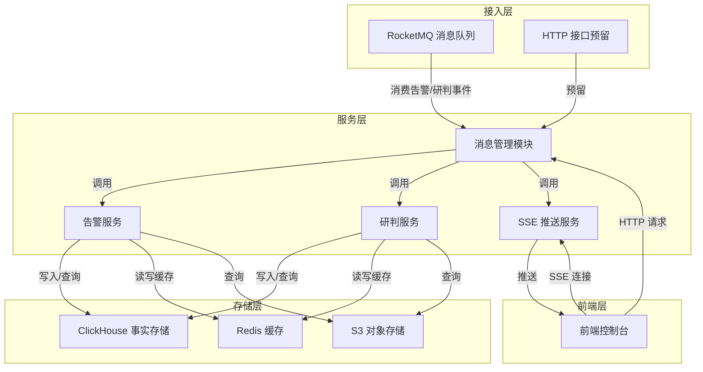
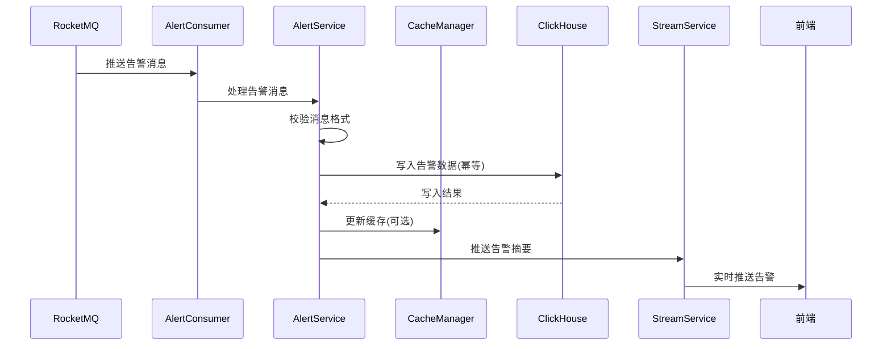
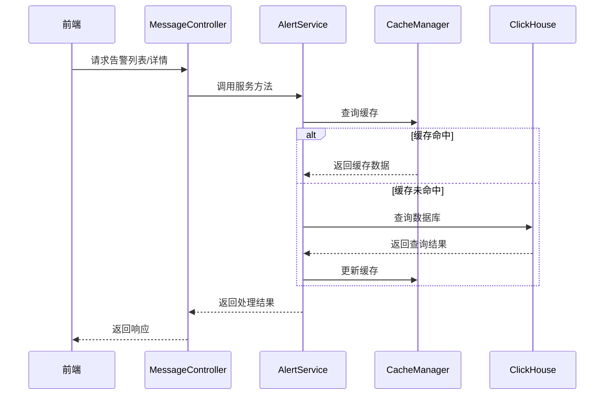
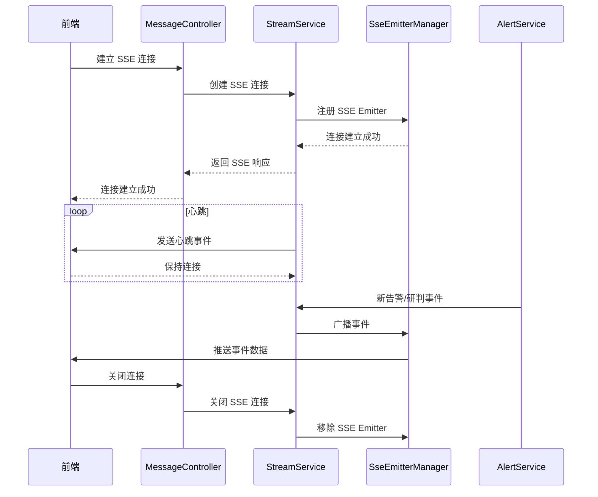
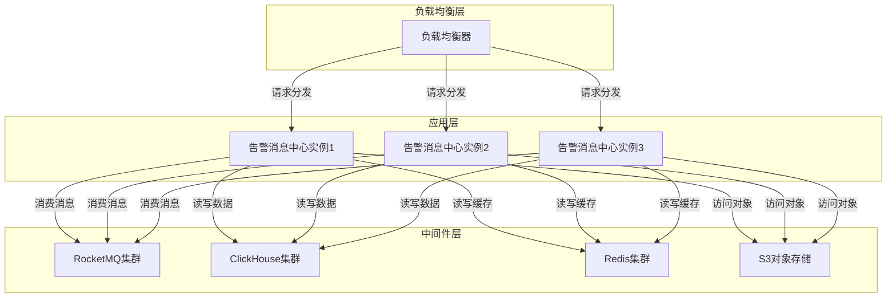

# 告警消息中心（Alert Message Center）技术侧详细设计说明书

> **负责人**：张海玉  
> **日期**：2026-03-11  
> **版本**：v1.0

---

## 1. 技术架构详细设计

### 1.1 整体架构



### 1.2 模块划分与职责

| 模块 | 包路径 | 主要职责 | 核心类/接口 |
|------|---------|----------|------------|
| 消息管理模块 | `com.megvii.agent.platform.message` | 统一消息处理入口 | `MessageController` |
| 告警服务 | `com.megvii.agent.platform.message.alert` | 告警相关业务逻辑 | `AlertService`、`AlertRepository` |
| 研判服务 | `com.megvii.agent.platform.message.judge` | 研判相关业务逻辑 | `JudgeService`、`JudgeRepository` |
| SSE 推送服务 | `com.megvii.agent.platform.message.stream` | 实时推送业务逻辑 | `StreamService`、`SseEmitterManager` |
| 消息消费 | `com.megvii.agent.platform.message.consumer` | MQ 消息消费 | `AlertConsumer`、`JudgeConsumer` |
| 数据访问 | `com.megvii.agent.platform.message.repository` | 数据存储访问 | `ClickHouseRepository` |
| 缓存 | `com.megvii.agent.platform.message.cache` | 缓存管理 | `CacheManager` |
| 监控 | `com.megvii.agent.platform.message.monitor` | 监控与告警 | `MonitorService` |

### 1.3 核心流程

#### 1.3.1 告警接入流程



#### 1.3.2 告警查询流程



#### 1.3.3 SSE 推送流程



---

## 2. 核心类与方法设计

### 2.1 消息管理模块

#### 2.1.1 MessageController

| 方法名 | 描述 | 参数 | 返回值 | 异常 |
|-------|------|------|-------|------|
| `getAlerts` | 获取告警列表 | `AlertQueryParams` | `Response<List<AlertDTO>>` | `AMC_PARAM_INVALID` |
| `getAlertDetail` | 获取告警详情 | `String alertId` | `Response<AlertDetailDTO>` | `AMC_ALERT_NOT_FOUND` |
| `getAlertNeighbor` | 获取告警上下一条 | `AlertNeighborParams` | `Response<AlertDTO>` | `AMC_PARAM_INVALID` |
| `getTodayAlerts` | 获取今日告警 | 无 | `Response<List<AlertDTO>>` | `AMC_STORAGE_ERROR` |
| `getStream` | 获取 SSE 流 | `StreamParams` | `SseEmitter` | `AMC_STREAM_ERROR` |

> **研判 HTTP 接口**见 `JudgeController`（`/api/v1/datapool/judgement`）：列表 `POST .../records`、详情 `GET .../records/{recordId}`，返回 `Result<PageResult<JudgeRecord>>` / `Result<JudgeRecordDetail>`。

#### 2.1.2 数据传输对象 (DTOs)

**AlertQueryParams**
| 字段名 | 类型 | 描述 |
|-------|------|------|
| `startTime` | `String` | 开始时间 |
| `endTime` | `String` | 结束时间 |
| `planName` | `String` | 计划名称 |
| `sourceIds` | `List<String>` | 数据源编码列表（通道/文件混合） |
| `skillName` | `String` | 技能名称 |
| `pageNo` | `Integer` | 页码 |
| `pageSize` | `Integer` | 每页条数 |

**AlertDTO**
| 字段名 | 类型 | 描述 |
|-------|------|------|
| `alertId` | `String` | 告警 ID |
| `title` | `String` | 告警标题 |
| `thumbnailUrl` | `String` | 缩略图 URL |
| `type` | `String` | 告警类型 |
| `location` | `String` | 点位/位置 |
| `cameraId` | `String` | 摄像头 ID |
| `alertTime` | `String` | 告警时间 |

**AlertDetailDTO**
| 字段名 | 类型 | 描述 |
|-------|------|------|
| `alertId` | `String` | 告警 ID |
| `title` | `String` | 告警标题 |
| `imageUrl` | `String` | 大图 URL |
| `type` | `String` | 告警类型 |
| `location` | `String` | 点位/位置 |
| `cameraId` | `String` | 摄像头 ID |
| `cameraName` | `String` | 摄像头名称 |
| `cameraCode` | `String` | 摄像头编码 |
| `alertTime` | `String` | 告警时间 |
| `planName` | `String` | 计划名称 |
| `skillName` | `String` | 技能名称 |
| `description` | `String` | 预警描述 |

**JudgeRecordDTO**
| 字段名 | 类型 | 描述 |
|-------|------|------|
| `recordId` | `String` | 记录 ID |
| `planName` | `String` | 计划名称 |
| `skillName` | `String` | 技能名称 |
| `taskName` | `String` | 任务名称 |
| `startTime` | `String` | 开始时间 |
| `endTime` | `String` | 结束时间 |
| `status` | `String` | 状态 |

**JudgeRecordDetailDTO**
| 字段名 | 类型 | 描述 |
|-------|------|------|
| `recordId` | `String` | 记录 ID |
| `planName` | `String` | 计划名称 |
| `skillName` | `String` | 技能名称 |
| `taskName` | `String` | 任务名称 |
| `startTime` | `String` | 开始时间 |
| `endTime` | `String` | 结束时间 |
| `duration` | `Long` | 耗时(毫秒) |
| `status` | `String` | 状态 |
| `videoUrl` | `String` | 视频 URL |
| `keyframePoints` | `List<KeyframePointDTO>` | 关键帧点位 |
| `steps` | `List<StepDTO>` | 步骤明细 |

### 2.2 告警服务

#### 2.2.1 AlertService

| 方法名 | 描述 | 参数 | 返回值 | 异常 |
|-------|------|------|-------|------|
| `processAlertMessage` | 处理告警消息 | `AlertMessage` | `boolean` | `AMC_STORAGE_ERROR` |
| `getAlerts` | 获取告警列表 | `AlertQueryParams` | `PageResult<AlertDTO>` | `AMC_PARAM_INVALID` |
| `getAlertDetail` | 获取告警详情 | `String alertId` | `AlertDetailDTO` | `AMC_ALERT_NOT_FOUND` |
| `getAlertNeighbor` | 获取告警上下一条 | `AlertNeighborParams` | `AlertDTO` | `AMC_PARAM_INVALID` |
| `getTodayAlerts` | 获取今日告警 | 无 | `List<AlertDTO>` | `AMC_STORAGE_ERROR` |

#### 2.2.2 AlertRepository

| 方法名 | 描述 | 参数 | 返回值 | 异常 |
|-------|------|------|-------|------|
| `saveAlert` | 保存告警 | `AlertEntity` | `boolean` | `AMC_STORAGE_ERROR` |
| `getAlerts` | 查询告警列表 | `AlertQueryParams` | `List<AlertEntity>` | `AMC_STORAGE_ERROR` |
| `getAlertById` | 根据 ID 查询告警 | `String alertId` | `AlertEntity` | `AMC_ALERT_NOT_FOUND` |
| `getAlertNeighbor` | 查询相邻告警 | `AlertNeighborParams` | `AlertEntity` | `AMC_STORAGE_ERROR` |
| `getTodayAlerts` | 查询今日告警 | 无 | `List<AlertEntity>` | `AMC_STORAGE_ERROR` |

#### 2.2.3 Workflow 告警接入（与代码路径对齐）

| 组件 | 说明 |
|------|------|
| `RocketMQConfig.AlertMessageConsumer` | 订阅告警 Topic，消息体为 JSON 字符串 |
| `MessageProcessService` | `DataConverterService#parseWorkflowAlert` 反序列化为 `AlertMessage` 后异步处理 |
| `AsyncTaskService#processAlertMessageAsync` | `ensureAlertDefaults` + `normalizeWorkflowAlert`，图片转存后 `toAlertDO` 写 ClickHouse、`buildWorkflowAlertPushJson` 经 SSE/WebSocket 推送 |
| `DataConverterService` | 专用 `ObjectMapper`（无全局 `SNAKE_CASE`）；按契约处理 `meta_data`、`AlertMessage` ↔ `AlertDO`、推送 JSON、`fromStoredAlertEvent`；研判事实抽取读取规范 JSON 的 `meta_data` |
| `AlertDao` / `AlertMapper` | `insertAlert(AlertDO)` → `AlertEvent` 后对 `workflow_event` 表 INSERT；列表筛选优先使用物理列（`plan_name`、`skill_id`、`source_id`、`source_type`、`timestamp`） |

> **说明**：SOP 研判仍走 `T_AMC_sop_EVENT_IN` 与 `convertSopEventToClickHouse`，与 Workflow 告警链路独立。

### 2.3 研判服务

#### 2.3.1 JudgeService（`JudgeServiceImpl`）

| 方法名 | 描述 | 参数 | 返回值 | 异常 |
|-------|------|------|-------|------|
| `getJudgeRecordList` | 研判记录分页列表 | `JudgeRecordRequest`（`pageNum` / 兼容 `pageNo`） | `PageResult<JudgeRecord>` | 参数非法等 |
| `getJudgeRecordDetail` | 研判记录详情 | `String recordId`（`instance_id`） | `JudgeRecordDetail` | `AMC_RECORD_NOT_FOUND` |

#### 2.3.2 JudgeEventDao

| 方法名 | 描述 | 参数 | 返回值 |
|-------|------|------|-------|
| `insertJudgeEvent` | 写入研判事实行 | `Map`（标准化字段） | `void` |
| `getJudgeRecordList` | 列表行 | `JudgeRecordRequest` | `List<JudgeRecord>` |
| `getJudgeRecordCount` | 列表总数 | `JudgeRecordRequest` | `long` |
| `getJudgeRecordDetailBase` | 详情头（实例快照） | `instanceId` | `Map` |
| `getJudgeRecordStepTimeline` | 详情步骤（节点快照） | `instanceId` | `List<StepRecord>` |
| `getSopStatistics` | SOP 维度统计 | `conditions` | `List<Map<String,Object>>` |

持久化映射见 `JudgeEventMapper` / `mapper/message/JudgeEventMapper.xml`。

### 2.4 SSE 推送服务

#### 2.4.1 StreamService

| 方法名 | 描述 | 参数 | 返回值 | 异常 |
|-------|------|------|-------|------|
| `createWorkflowSseEmitter` | 创建 Workflow 专用 SSE | `sourceIds, planIds, skillIds, tenantIds, sinceTime`（`sinceTime` 为 UTC 毫秒，可选） | `SseEmitter` | `AMC_STREAM_ERROR` |
| `createSopSseEmitter` | 创建 SOP 研判专用 SSE | 同上 | `SseEmitter` | `AMC_STREAM_ERROR` |
| `pushAlert` | 推送 Workflow 告警 | RocketMQ 同构 JSON 字符串 | `void` | 无 |
| `pushJudgeEvent` | 推送研判事件（仅 SOP SSE） | `JSONObject` | `void` | 无 |
| `registerWorkflowAlertWebSocket` | 注册 WebSocket 会话 | `WebSocketSession`, 查询参数 | `void` | 无 |
| `unregisterWorkflowAlertWebSocket` | 注销 WebSocket | `WebSocketSession` | `void` | 无 |

#### 2.4.2 WebSocket（Workflow 告警）

| 类 | 说明 |
|----|------|
| `WebSocketConfig` | 注册 `/api/v1/datapool/ws/stream` |
| `WorkflowAlertWebSocketHandler` | 握手后注册会话；支持客户端 `ping` 文本 |

#### 2.4.3 SseEmitterManager

| 方法名 | 描述 | 参数 | 返回值 | 异常 |
|-------|------|------|-------|------|
| `addEmitter` | 添加 SSE Emitter | `String connectionId`, `SseEmitter` | `void` | 无 |
| `removeEmitter` | 移除 SSE Emitter | `String connectionId` | `void` | 无 |
| `broadcast` | 广播消息 | `String eventType`, `Object data` | `void` | 无 |
| `broadcastByCameraIds` | 按相机 ID 广播 | `String eventType`, `Object data`, `Set<String> cameraIds` | `void` | 无 |
| `getConnectionCount` | 获取连接数 | 无 | `int` | 无 |

### 2.5 消息消费

#### 2.5.1 AlertConsumer

| 方法名 | 描述 | 参数 | 返回值 | 异常 |
|-------|------|------|-------|------|
| `consume` | 消费告警消息 | `MessageExt` | `ConsumeConcurrentlyStatus` | 无 |
| `processMessage` | 处理消息内容 | `String message` | `boolean` | 无 |

#### 2.5.2 JudgeConsumer

| 方法名 | 描述 | 参数 | 返回值 | 异常 |
|-------|------|------|-------|------|
| `consume` | 消费研判事件 | `MessageExt` | `ConsumeConcurrentlyStatus` | 无 |
| `processMessage` | 处理消息内容 | `String message` | `boolean` | 无 |

### 2.6 数据访问

#### 2.6.1 ClickHouseRepository

| 方法名 | 描述 | 参数 | 返回值 | 异常 |
|-------|------|------|-------|------|
| `executeQuery` | 执行查询 | `String sql`, `Object... params` | `ResultSet` | `AMC_STORAGE_ERROR` |
| `executeUpdate` | 执行更新 | `String sql`, `Object... params` | `int` | `AMC_STORAGE_ERROR` |
| `batchExecute` | 批量执行 | `String sql`, `List<Object[]> params` | `int[]` | `AMC_STORAGE_ERROR` |

### 2.7 缓存

#### 2.7.1 CacheManager

| 方法名 | 描述 | 参数 | 返回值 | 异常 |
|-------|------|------|-------|------|
| `get` | 获取缓存 | `String key` | `Object` | 无 |
| `set` | 设置缓存 | `String key`, `Object value`, `long expiration` | `void` | 无 |
| `delete` | 删除缓存 | `String key` | `void` | 无 |
| `getAlertsCacheKey` | 生成告警列表缓存键 | `AlertQueryParams` | `String` | 无 |
| `getAlertDetailCacheKey` | 生成告警详情缓存键 | `String alertId` | `String` | 无 |

### 2.8 监控

#### 2.8.1 MonitorService

| 方法名 | 描述 | 参数 | 返回值 | 异常 |
|-------|------|------|-------|------|
| `recordMessageConsume` | 记录消息消费 | `String messageType`, `long latency` | `void` | 无 |
| `recordQueryLatency` | 记录查询延迟 | `String queryType`, `long latency` | `void` | 无 |
| `recordStreamEvent` | 记录流事件 | `String eventType` | `void` | 无 |
| `checkStorageHealth` | 检查存储健康 | 无 | `boolean` | 无 |
| `checkStreamConnections` | 检查流连接数 | 无 | `int` | 无 |

---

## 3. 数据库与数据结构详细设计

### 3.1 告警事实表（`workflow_event`）

Workflow 告警使用单表 `workflow_event`：核心筛选维度为物理列（`tenant_id`、`plan_id`、`skill_id`、`source_id`、`source_type`、`timestamp`），`meta_data`/`custom`/`targets`/`tags` 为 JSON 字符串列。完整 DDL 见 `docker/init/clickhouse-init/V1__init.sql`。

### 3.2 研判事件事实表（sop_event）

SOP 合规数据采用 **append-only** 事件事实模型，不再依赖高频更新单行状态。

**核心字段**
- 事件维度：`event_id`、`instance_id`、`event_type`、`event_time`、`event_time_ms`
- 业务维度：`tenant_id`、`plan_id`、`skill_id`、`source_id`、`source_name`、`add_type`
- SOP 字段：`sop_status`、`timeline`、`anomalies`、`node_id`、`node_name`、`frame_keys`
- 审计字段：`raw_payload`、`normalized_payload`

### 3.3 研判快照表与物化视图

- `sop_instance`：实例查询表（列表/统计查询表）
- `sop_node_event`：步骤查询表（详情步骤查询表）
- `mv_sop_event_to_instance`：事实事件 -> 实例查询表
- `mv_sop_event_to_node`：事实事件 -> 步骤查询表

完整 DDL 与 MV 定义见 `docker/init/clickhouse-init/V1__init.sql`。

#### 3.3.1 运维执行：存量库 ClickHouse TTL 一次性对齐

**背景**：统一保留策略会对 `workflow_event`、`sop_event`、`sop_instance`、`sop_node_event` 四张表分别下发 TTL；物化视图 `mv_sop_event_to_instance`、`mv_sop_event_to_node` **不需要**因 TTL 变更而改定义，仅需保证快照表自身 TTL 与事实表策略一致（避免仅删 `sop_event` 而快照表长期残留）。

**操作**：在目标库执行以下语句，将 `agent_platform` 与 `30` 替换为实际库名与保留天数（TTL 表达式与 `WorkflowAlertRetentionServiceImpl` 一致）：

```sql
USE agent_platform;

ALTER TABLE workflow_event
MODIFY TTL toDateTime(`timestamp`) + INTERVAL 30 DAY DELETE;

ALTER TABLE sop_event
MODIFY TTL toDateTime(event_time) + INTERVAL 30 DAY DELETE;

ALTER TABLE sop_instance
MODIFY TTL toDateTime(start_time) + INTERVAL 30 DAY DELETE;

ALTER TABLE sop_node_event
MODIFY TTL toDateTime(ifNull(coalesce(step_start_time, step_end_time), toDateTime64(0, 3))) + INTERVAL 30 DAY DELETE;
```

**验证**：

```sql
SHOW CREATE TABLE workflow_event;
SHOW CREATE TABLE sop_event;
SHOW CREATE TABLE sop_instance;
SHOW CREATE TABLE sop_node_event;
```

表名若与默认不同，以 `megvii.clickhouse.alerts-table`、`megvii.clickhouse.sop-event-table`、`megvii.clickhouse.sop-instance-table`、`megvii.clickhouse.sop-node-event-table` 配置为准。

### 3.4 数据传输对象 (DTOs) 详细设计

**AlertMessage**（`com.megvii.agent.platform.message.bean.AlertMessage`，列表与详情一致，与 RocketMQ §3.0.1 对齐；`meta_data` 为固定 JSON 键名）
| 字段名（JSON） | 类型 | 描述 |
|-------|------|------|
| `timestamp` | `Long` | 毫秒时间戳，对应 RocketMQ `timestamp` |
| `id` | `String` | 告警 ID，对应 RocketMQ `id` |
| `image` | `String` | 图片 URL（列表/详情为预签名）；消费链路中可先为原始 URL 再替换为对象存储 key |
| `custom` | `Map<String,Object>` | 对应 RocketMQ `custom` / 表 `custom` 列（JSON 字符串） |
| `meta_data`（MQ/规范 JSON） / 列 `meta_data`（库） | `WorkflowAlertMetaData` | Workflow 告警专用嵌套类型（`com.megvii.agent.platform.message.bean.WorkflowAlertMetaData`）：`planId`、`tenantId`、`sourceType` 等（内层 camelCase）；未知键经 `@JsonAnySetter` 保留。入站顶层键无 `meta_data` 仅有 `metaData` 时，消费端先规范为 `meta_data` 再反序列化。SOP 研判 MQ 内层 `meta_data` 使用独立类型 `JudgeSopEventMetaData`，见 `JudgeSopEvents.Base` |
| `targets` | `List<AlertMessage.Target>` | 对应 RocketMQ `targets` |
| `tags` | `List<AlertMessage.Tag>` | 对应 RocketMQ `tags` |

**AlertDO**（ClickHouse `workflow_event` 行写入模型，与 MQ 契约解耦）
| 字段 | 类型 | 描述 |
|-------|------|------|
| `timestamp` | `Long` | 毫秒时间戳，映射为 `DateTime64` |
| `id` / `image` / 维度列 | `String` | 与表物理列一致；`image` 为转存后 key |
| `custom` / `meta_data` / `targets` / `tags` | `String` | JSON 文本列 |

**JudgeEvent（事实表入库模型）**
| 字段名 | 类型 | 描述 |
|-------|------|------|
| `eventId` | `String` | 事件 ID |
| `instanceId` | `String` | SOP 实例 ID |
| `tenantId` | `String` | 租户 ID |
| `planId` | `String` | 计划 ID |
| `planName` | `String` | 计划名称 |
| `skillId` | `String` | 技能 ID |
| `skillName` | `String` | 技能名称 |
| `sourceType` | `String` | 来源类型（channel/file） |
| `sourceId` | `String` | 来源 ID（通道或文件） |
| `sourceName` | `String` | 来源名称 |
| `eventType` | `String` | 事件类型 |
| `nodeId` | `Integer` | 节点序号 |
| `nodeName` | `String` | 节点名称 |
| `status` | `String` | 状态 |
| `eventTime` | `Date` | 事件时间 |
| `stepStartTime` | `Date` | 步骤开始时间 |
| `stepEndTime` | `Date` | 步骤结束时间 |
| `actualDuration` | `Double` | 实际耗时 |
| `detail` | `String` | 节点说明 |
| `frameKeys` | `String` | 关键帧对象 key 列表（JSON） |

---

## 4. 接口实现细节

### 4.1 告警管理接口

#### 4.1.1 告警列表接口

**接口**：`GET /api/v1/datapool/alerts`

**实现逻辑**：
1. 接收请求参数，进行参数校验
2. 构建缓存键，尝试从缓存获取数据
3. 缓存未命中时，构建查询 SQL，调用 ClickHouse 查询
4. 将查询结果转换为 DTO 列表
5. 更新缓存，设置过期时间
6. 返回响应

**查询说明（与 `AlertMapper.xml` 一致）**：从 `workflow_event` 查询；`plan_name`、`skill_id`、`source_id`、`timestamp` 等过滤走物理列。

**示例 SQL**：
```sql
SELECT
    `timestamp`,
    id,
    image,
    custom,
    tenant_id,
    plan_id,
    skill_id,
    source_id,
    source_type,
    plan_name,
    skill_name,
    source_name,
    meta_data,
    targets,
    tags
FROM workflow_event
WHERE 1=1
    AND (:sourceIds IS NULL OR source_id IN (:sourceIds))
    AND (:startTime IS NULL OR `timestamp` >= :startTime)
    AND (:endTime IS NULL OR `timestamp` <= :endTime)
    AND (:planName IS NULL OR plan_name LIKE concat('%', :planName, '%'))
ORDER BY `timestamp` DESC
LIMIT :limit OFFSET :offset
```

#### 4.1.2 告警详情接口

**接口**：`GET /api/v1/datapool/alerts/{alertId}`

**实现逻辑**：
1. 接收告警 ID，进行参数校验
2. 构建缓存键，尝试从缓存获取数据
3. 缓存未命中时，构建查询 SQL，调用 ClickHouse 查询
4. 将查询结果转换为 DTO
5. 更新缓存，设置过期时间
6. 返回响应

**查询 SQL**：
```sql
SELECT
    `timestamp`, id, image, custom,
    tenant_id, plan_id, skill_id, source_id, source_type,
    plan_name, skill_name, source_name,
    meta_data, targets, tags
FROM workflow_event
WHERE id = :alertId
```

#### 4.1.3 今日告警接口

**接口**：`GET /api/v1/datapool/alerts/today`

**实现逻辑**：
1. 计算今日开始时间
2. 构建查询 SQL，调用 ClickHouse 查询
3. 将查询结果转换为 DTO 列表
4. 返回响应

**查询 SQL（示例）**：
```sql
SELECT
    `timestamp`, id, image, custom,
    tenant_id, plan_id, skill_id, source_id, source_type,
    plan_name, skill_name, source_name,
    meta_data, targets, tags
FROM workflow_event
WHERE
    (:tenantId IS NULL OR tenant_id = :tenantId)
    AND `timestamp` >= toStartOfDay(now())
ORDER BY `timestamp` DESC
LIMIT 100
```

### 4.2 研判管理接口

#### 4.2.1 研判记录列表接口

**接口**：`POST /api/v1/datapool/judgement/records`  
**控制器**：`JudgeController#getJudgeRecordList`  
**请求体**：`JudgeRecordRequest`（分页字段 **`pageNum`**，JSON 兼容 **`pageNo`**，与 `PageResult` 一致）  
**返回**：`Result<PageResult<JudgeRecord>>`

**实现逻辑**：
1. 接收请求体，调用 `request.calculateOffset()` 规范化页码/页大小并计算 `offset`
2. 通过 `JudgeEventDao` / `JudgeEventMapper#selectJudgeRecordList` 查询 **`sop_instance`**
3. 将行映射为 `JudgeRecord` 列表，并查询总数封装为 `PageResult`

**查询要点（与 `JudgeEventMapper.xml` 一致）**：
- 主表：`sop_instance`；列表主键展示列 `instance_id` → `recordId`
- 动态条件：`start_time` / `end_time` 范围、`plan_name` LIKE、`skill_id` IN、`source_id` IN（通道列表）、`sop_status` IN 等
- 排序：`ORDER BY start_time DESC`；分页：`LIMIT pageSize OFFSET offset`

```sql
-- 示意（完整动态 SQL 见 src/main/resources/mapper/message/JudgeEventMapper.xml）
SELECT
    instance_id AS recordId,
    plan_name, skill_name,
    formatDateTime(start_time, '%Y-%m-%d %H:%M:%S') AS startTime,
    formatDateTime(end_time, '%Y-%m-%d %H:%M:%S') AS endTime,
    sop_status AS status,
    source_type AS sourceType,
    source_id AS sourceId,
    source_name AS sourceName,
    add_type AS addType
FROM sop_instance
WHERE 1 = 1
  /* 与请求体非空字段对应的 AND 条件 */
ORDER BY start_time DESC
LIMIT ? OFFSET ?
```

#### 4.2.2 研判记录详情接口

**接口**：`GET /api/v1/datapool/judgement/records/{recordId}`  
**实现**：`JudgeServiceImpl` 读取实例查询 + 节点查询（`sop_instance`、`sop_node_event`），步骤含关键帧 key 的预签名 URL 由 `ImageService` 处理

**实现逻辑**：
1. 接收 `recordId`（即 `instance_id`），校验非空
2. 查询实例快照行；再按 `instance_id` 查询节点快照列表并组装 `JudgeRecordDetail`
3. 返回 `Result<JudgeRecordDetail>`

**查询要点**：具体列与 JOIN 以 `JudgeEventMapper.xml` 中详情相关语句及 `JudgeServiceImpl` 为准（不再使用早期示意表名）。

### 4.3 SSE 推送接口

**Workflow 告警**：`GET /api/v1/datapool/stream/workflow`（`text/event-stream`）  
**SOP 研判**：`GET /api/v1/datapool/stream/sop`（`text/event-stream`）  
两路 **独立注册、独立索引**，不再使用 `types` 混流；查询参数均支持 `sourceIds`、`planIds`、`skillIds`、`tenantIds`（逗号分隔，均可空；全空表示全量）及可选 `sinceTime`（**UTC 毫秒**）。

**实现逻辑（单路）**：
1. 接收请求参数，进行参数校验
2. 创建 SSE Emitter，设置超时时间
3. 将 Emitter 注册到对应通道的管理结构（Workflow 与 SOP 分离）
4. 共享调度：心跳线程定期向两路已注册 Emitter 发送心跳
5. 处理连接关闭事件并完成反注册
6. 返回 SSE Emitter

**推送逻辑**：
1. 接收新的告警或研判事件
2. **Workflow**：`pushAlert` 仅向 Workflow SSE 订阅者与 WebSocket 订阅者推送，按 `meta_data` 与订阅过滤条件匹配
3. **SOP**：`pushJudgeEvent` 仅向 SOP SSE 订阅者推送，按载荷中的 `sourceId`/`planId`/`skillId`/`tenantId`（及兼容字段）与订阅过滤条件匹配
4. 构建推送数据并写入对应通道
5. 记录推送指标（如有）

---
### 4.4 统计接口

#### 4.4.1 Workflow 告警统计

**接口**：`GET /api/v1/datapool/statistics/workflow`

**入参（query）**：
- `planId`：计划 ID
- `skillId`：技能 ID
- `sourceId`：数据源 ID
- `startTime`：开始时间
- `endTime`：结束时间

#### 4.4.2 SOP 解析结果统计

**接口**：`GET /api/v1/datapool/statistics/sop`

**入参（query）**：
- `planId`：计划 ID
- `skillId`：技能 ID
- `sourceId`：数据源 ID
- `startTime`：开始时间
- `endTime`：结束时间

#### 4.4.3 按维度组合统计

**接口**：`GET /api/v1/datapool/statistics/group`  
**实现**：`StatisticsController` → `StatisticsServiceImpl#getStatisticsByGroup(conditions, groupBy, dataSource)`，使用 ClickHouse `JdbcTemplate` 拼动态 SQL

**入参（query）**：
- `dataSource`：可选，默认 **`workflow`**
  - **`workflow`**：`FROM workflow_event`，时间过滤列 **`timestamp`**
  - **`sop`**：`FROM sop_instance`，`sourceId` 映射 **`source_id`**，时间范围按实例 **`start_time`** 过滤（与组合统计在 SOP 侧的口径一致）
- `planId`：计划 ID（可选）
- `skillId`：技能 ID（可选）
- `sourceId`：数据源 ID（可选）
- `startTime` / `endTime`：可选；解析使用 `parseDateTime64BestEffortOrNull(?, 3)`
- `groupBy`：必填；**白名单** `plan_id`、`skill_id`、`source_id`、`alert_date`（workflow：`toDate(timestamp)`；sop：`toDate(start_time)`）

**出参**：`total` 为各分组行 `COUNT` 之和；`details` 为分组结果行列表（与实现一致）

### 4.5 数据保留策略接口

**接口**：`GET /api/v1/datapool/retention`  
**实现**：`MessageRetentionController#getMessageDataRetention` → `WorkflowAlertRetentionService`（读取四表 DDL 解析 TTL 天数）+ `AlertImageBucketLifecycleService`（读取 bucket Lifecycle 中受管规则天数）

**接口**：`PUT /api/v1/datapool/retention`  
**实现**：`MessageRetentionController#updateMessageDataRetention` → `MessageDataRetentionUpdateReq#resolveEffectiveDays`（`retentionDays` 与 `clickhouseRetentionDays`/`objectStorageRetentionDays` 互斥；单侧新字段时另一侧继承）→ `WorkflowAlertRetentionService#updateRetentionDays`（依次 `ALTER TABLE`：`workflow_event`、`sop_event`、`sop_instance`、`sop_node_event`）→ `AlertImageBucketLifecycleService#upsertAlertImageExpirationDays`

**入参（JSON body）**：
- `retentionDays`（可选）：兼容字段，与对象存储同天数；
- `clickhouseRetentionDays`（可选）、`objectStorageRetentionDays`（可选）：拆分设置；**不得**与 `retentionDays` 同时出现；
- 取值范围：1～3650（与实现校验一致）。

**注意**：若 S3 Lifecycle 步骤失败，ClickHouse 可能已部分或全部 `MODIFY TTL` 成功，错误信息中会提示运维按 §3.3.1 手工核对。

---

## 5. 性能优化具体实现

### 5.1 查询优化

1. **利用 ClickHouse 排序键**：
   - 按 `tenant_id + alert_time + alert_id` 排序，优化时间范围查询
   - 利用前缀匹配特性，减少数据扫描范围

2. **分区策略**：
   - 按 `alert_time` 日期分区，提高时间范围查询性能
   - 利用分区裁剪，减少查询的数据量

3. **物化视图**：
   - 为研判记录列表创建物化视图，预计算聚合结果
   - 减少查询时的计算开销

4. **二级索引**：
   - 为 `camera_id`、`plan_name`、`skill_name` 创建二级索引
   - 加速按这些字段的过滤查询

### 5.2 缓存策略

1. **热点数据缓存**：
   - 对频繁访问的告警列表和详情进行缓存
   - 使用 Redis 作为缓存存储

2. **缓存键设计**：
   - 告警列表：`alert:list:{tenantId}:{startTime}:{endTime}:{planName}:{skillName}:{pageNo}:{pageSize}`
   - 告警详情：`alert:detail:{alertId}`
   - 研判记录：`judge:record:{recordId}`

3. **缓存过期时间**：
   - 告警列表：5 分钟
   - 告警详情：10 分钟
   - 研判记录：10 分钟

4. **缓存更新策略**：
   - 写入新数据时更新相关缓存
   - 使用惰性删除，过期后自动失效

### 5.3 批量处理

1. **MQ 消息批量消费**：
   - 配置 RocketMQ 消费者批量消费
   - 每次消费多条消息，减少数据库写入次数

2. **数据库批量写入**：
   - 使用 ClickHouse 批量插入
   - 减少网络往返开销

3. **接口分页**：
   - 强制限制 `pageSize <= 100`
   - 避免一次性返回大量数据

### 5.4 并行处理

1. **查询并行**：
   - 对独立的查询任务使用并行流处理
   - 提高多条件查询的响应速度

2. **异步处理**：
   - 消息消费采用异步处理
   - 不阻塞主线程

3. **SSE 推送异步**：
   - 推送操作异步执行
   - 不影响主业务流程

---

## 6. 监控与日志具体实现

### 6.1 监控指标

1. **消息消费指标**：
   - 消费延迟：`amc.message.consume.latency`
   - 消费速率：`amc.message.consume.rate`
   - 消费失败率：`amc.message.consume.failure.rate`

2. **存储指标**：
   - 存储使用率：`amc.storage.usage`
   - 写入延迟：`amc.storage.write.latency`
   - 查询响应时间：`amc.storage.query.latency`

3. **接口指标**：
   - 接口调用量：`amc.api.call.count`
   - 响应时间：`amc.api.response.time`
   - 错误率：`amc.api.error.rate`

4. **SSE 指标**：
   - 连接数：`amc.stream.connection.count`
   - 推送延迟：`amc.stream.push.latency`
   - 重连次数：`amc.stream.reconnect.count`

### 6.2 日志记录

1. **业务日志**：
   - 日志级别：INFO
   - 格式：`[AMC] [业务类型] [操作] [结果] [详情]`
   - 示例：`[AMC] [Alert] [Process] [Success] AlertId: alert_001, SourceEventId: event_001`

2. **错误日志**：
   - 日志级别：ERROR
   - 格式：`[AMC] [错误类型] [错误信息] [堆栈]`
   - 示例：`[AMC] [StorageError] [ClickHouse connection failed] java.sql.SQLException: Connection refused`

3. **审计日志**：
   - 日志级别：INFO
   - 格式：`[AMC] [Audit] [操作] [用户] [时间] [详情]`
   - 示例：`[AMC] [Audit] [GetAlert] [admin] [2026-03-11 10:00:00] AlertId: alert_001`

### 6.3 告警机制

1. **消息消费延迟告警**：
   - 阈值：消费延迟超过 5 分钟
   - 通知方式：邮件 + 短信

2. **存储使用率告警**：
   - 阈值：存储使用率超过 80%
   - 通知方式：邮件 + 短信

3. **接口错误率告警**：
   - 阈值：错误率超过 5%
   - 通知方式：邮件

4. **SSE 连接数告警**：
   - 阈值：连接数超过 1000
   - 通知方式：邮件

---

## 7. 部署与集成方案

### 7.1 依赖管理

| 依赖 | 版本 | 用途 |
|------|------|------|
| `rocketmq-client` | 4.9.4 | RocketMQ 客户端 |
| `clickhouse-jdbc` | 0.3.2 | ClickHouse JDBC 驱动 |
| `spring-boot-starter-web` | 2.7.15 | Spring Web 支持 |
| `spring-boot-starter-data-redis` | 2.7.15 | Redis 缓存支持 |
| `micrometer-registry-prometheus` | 1.9.10 | Prometheus 监控 |
| `lombok` | 1.18.24 | 代码简化 |
| `fastjson` | 1.2.83 | JSON 处理 |

### 7.2 配置项

| 配置项 | 类型 | 默认值 | 描述 |
|--------|------|--------|------|
| `rocketmq.namesrv.addr` | String | 127.0.0.1:9876 | RocketMQ 命名服务地址 |
| `rocketmq.consumer.group` | String | amc_workflow_event_consumer_group | 消费者组名 |
| `rocketmq.topic.alert` | String | T_AMC_workflow_event_IN | 告警主题 |
| `rocketmq.topic.judge` | String | T_AMC_sop_EVENT_IN | 研判事件主题 |
| `clickhouse.url` | String | jdbc:clickhouse://localhost:8123/default | ClickHouse 连接 URL |
| `clickhouse.username` | String | default | ClickHouse 用户名 |
| `clickhouse.password` | String | | ClickHouse 密码 |
| `redis.host` | String | localhost | Redis 主机 |
| `redis.port` | Integer | 6379 | Redis 端口 |
| `redis.password` | String | | Redis 密码 |
| `sse.timeout` | Integer | 300000 | SSE 超时时间(毫秒) |
| `sse.heartbeat.interval` | Integer | 30000 | 心跳间隔(毫秒) |
| `cache.alert.list.expiration` | Integer | 300 | 告警列表缓存过期时间(秒) |
| `cache.alert.detail.expiration` | Integer | 600 | 告警详情缓存过期时间(秒) |
| `cache.judge.record.expiration` | Integer | 600 | 研判记录缓存过期时间(秒) |

### 7.3 集成方案

1. **与设备管理模块集成**：
   - 通过 `camera_id` 关联设备信息
   - 可选调用设备管理接口获取详细信息
   - 接口：`GET /api/v1/device/info/{cameraId}`

2. **与视频服务模块集成**：
   - 通过 `camera_id` 获取视频流地址
   - 支持从告警详情跳转到视频实时播放
   - 接口：`GET /api/v1/video/stream/{cameraId}`

3. **与引擎模块集成**：
   - 接收引擎产生的研判事件
   - 为引擎提供告警数据查询能力
   - 接口：`GET /api/v1/datapool/alerts/engine`

4. **与前端模块集成**：
   - 提供 RESTful API 接口
   - 提供 SSE 实时推送接口
   - 前端使用 `EventSource` 建立 SSE 连接

### 7.4 部署架构



### 7.5 扩展性考虑

1. **水平扩展**：
   - 支持多实例部署，通过负载均衡分发请求
   - RocketMQ 消费者组确保消息只被消费一次

2. **存储扩展**：
   - ClickHouse 支持集群部署，可根据数据量扩展节点
   - 支持数据分片，提高查询性能

3. **功能扩展**：
   - 预留 HTTP 接入适配器，支持直接 HTTP 告警接入
   - 预留多渠道推送能力，支持邮件、短信等
   - 预留告警订阅规则管理能力

---

## 8. 测试计划

### 8.1 单元测试

| 测试类 | 测试方法 | 测试场景 |
|--------|----------|----------|
| `AlertServiceTest` | `testProcessAlertMessage` | 测试告警消息处理 |
| `AlertServiceTest` | `testGetAlerts` | 测试告警列表查询 |
| `AlertServiceTest` | `testGetAlertDetail` | 测试告警详情查询 |
| `JudgeServiceTest` | `testProcessJudgeEvent` | 测试研判事件处理 |
| `JudgeServiceTest` | `testGetJudgementRecords` | 测试研判记录查询 |
| `StreamServiceTest` | `testCreateWorkflowSseConnection` | 测试 Workflow SSE 连接创建 |
| `StreamServiceTest` | `testCreateSopSseConnection` | 测试 SOP SSE 连接创建 |
| `StreamServiceTest` | `testPushAlert` | 测试告警推送 |
| `CacheManagerTest` | `testGetAndSet` | 测试缓存操作 |

### 8.2 集成测试

| 测试场景 | 测试内容 | 预期结果 |
|----------|----------|----------|
| 告警接入流程 | 模拟 RocketMQ 消息，测试完整接入流程 | 消息消费成功，数据写入 ClickHouse |
| 告警查询流程 | 测试告警列表和详情查询 | 接口返回正确数据，缓存生效 |
| 研判事件流程 | 模拟研判事件，测试完整处理流程 | 事件处理成功，数据写入 ClickHouse |
| SSE 推送流程 | 分别建立 Workflow SSE、SOP SSE 连接，测试推送功能 | 连接建立成功，各通道仅收到对应类型消息 |
| 异常处理 | 模拟各种异常场景 | 系统能正确处理异常，返回合理错误码 |

### 8.3 性能测试

| 测试场景 | 测试内容 | 预期指标 |
|----------|----------|----------|
| 消息消费性能 | 测试消息消费速率和延迟 | 消费速率 > 1000 条/秒，延迟 < 100ms |
| 查询性能 | 测试告警列表和详情查询响应时间 | 列表查询 < 500ms，详情查询 < 200ms |
| SSE 推送性能 | 测试 SSE 连接数和推送延迟 | 支持 1000 并发连接，推送延迟 < 50ms |
| 缓存性能 | 测试缓存命中率 | 缓存命中率 > 80% |

---

## 9. 总结

本详细设计文档基于告警消息中心的概要设计，提供了完整的技术实现方案。文档涵盖了技术架构、核心类设计、数据库实现、接口细节、性能优化、监控日志、部署集成等各个方面，为开发团队提供了明确的实现指导。

通过本设计的实现，告警消息中心将具备以下能力：

1. **高效的告警接入与存储**：通过 RocketMQ 接收告警消息，写入 ClickHouse 存储，支持高吞吐量和低延迟。

2. **丰富的查询能力**：提供告警列表、详情、今日告警等查询接口，支持多维度筛选和分页。

3. **实时推送能力**：通过 SSE 实现实时告警推送，支持按相机订阅和动态订阅变更。

4. **智能研判支持**：支持研判事件处理和记录查询，提供详细的步骤状态和关键帧信息。

5. **高性能与可靠性**：通过缓存、批量处理、并行处理等优化手段，确保系统高性能运行。

6. **完善的监控与告警**：提供全面的监控指标和告警机制，确保系统稳定运行。

7. **良好的扩展性**：预留了多渠道推送、订阅规则管理等扩展能力，为后续功能演进奠定基础。

本设计方案符合 V1 版本的需求边界，同时为未来的功能扩展预留了充分的空间。