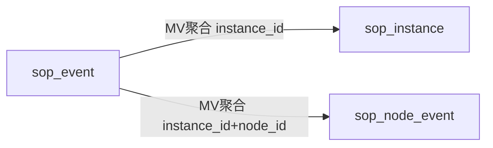

# SOP 合规告警详细设计（V2）

> **负责人**：张海玉  
> **日期**：2026-04-14  
> **版本**：v2.1

---

## 1. 目标与范围

本版详细设计按“先打通主链路”原则实现：

1. RocketMQ 消费 SOP 事件；
2. 解析并标准化事件；
3. 写入 ClickHouse 三表；
4. 提供 instance/node 查询与统计；
5. 推送 SSE / WebSocket 实时摘要。

本期明确不做复杂状态机推断，实例状态直接使用 `instance_end.status`。

---

## 2. 三表模型设计

## 2.1 表关系



### 2.2 `sop_event`（事实表）

用途：保存全部事件，作为唯一写入口和排障依据。

关键字段：

- `event_id`：事件 ID（核心事件强幂等，辅助事件可随机）
- `dedup_key`：去重键（核心强幂等 / 辅助弱去重）
- `event_type`：`sop_start/monitor_start/instance_start/node_start/node_end/instance_end/sop_end`
- `instance_id`、`node_id`
- `event_time`、`event_time_ms`
- `sop_status`（直接承接上游状态）
- `step_start_time`、`step_end_time`
- `raw_payload`、`normalized_payload`

### 2.3 `sop_instance`（实例查询表）

用途：实例列表与统计主查。

关键字段：

- `instance_id`
- `start_time`（来自 `instance_start`）
- `end_time`（来自 `instance_end`）
- `sop_status`（来自 `instance_end.status`）
- `timeline_json`、`anomalies_json`

### 2.4 `sop_node_event`（节点查询表）

用途：实例详情节点时间线主查。

关键字段：

- `instance_id` + `node_id`
- `step_start_time`（来自 `node_start`）
- `step_end_time`（来自 `node_end`）
- `node_status`（来自 `node_end.status`）
- `frame_keys_json`

---

## 3. DDL 方案（摘要）

> 完整 SQL 以 `docker/init/clickhouse-init/V1__init.sql` 为准。

```sql
CREATE TABLE IF NOT EXISTS sop_event (...) ENGINE = MergeTree
PARTITION BY toYYYYMM(event_time)
ORDER BY (tenant_id, plan_id, skill_id, source_id, instance_id, event_time_ms, event_id);

CREATE TABLE IF NOT EXISTS sop_instance (...) ENGINE = ReplacingMergeTree(snapshot_version)
PARTITION BY toYYYYMM(start_time)
ORDER BY (tenant_id, plan_id, skill_id, source_id, instance_id);

CREATE TABLE IF NOT EXISTS sop_node_event (...) ENGINE = ReplacingMergeTree(snapshot_version)
PARTITION BY toYYYYMM(ifNull(coalesce(step_start_time, step_end_time), toDateTime64(0, 3)))
ORDER BY (tenant_id, plan_id, skill_id, source_id, instance_id, node_id);
```

MV：

- `mv_sop_event_to_instance`：从 `sop_event` 汇总 `sop_instance`
- `mv_sop_event_to_node`：从 `sop_event` 汇总 `sop_node_event`

---

## 4. 事件入库逻辑

### 4.1 常量定义

- `JudgeEventTypeConstants`：事件类型常量 + 强幂等事件集合
- `JudgeTableConstants`：`sop_event/sop_instance/sop_node_event`

### 4.2 对象建模

- 入库实体统一使用 `JudgeEvent`（不再使用 `Map<String,Object>` 透传）
- 关键字段对象化：`eventId`、`dedupKey`、`eventType`、`instanceId`、`nodeId`、`stepStartTime`、`stepEndTime`

### 4.3 分级幂等

1. 强幂等事件：`node_end`、`instance_end`
   - `event_id = dedup_key`
2. 辅助事件：`sop_start`、`monitor_start`、`instance_start`、`node_start`、`sop_end`
   - `event_id = UUID`
   - `dedup_key = 短窗口桶`

---

## 5. 查询逻辑

### 5.1 实例列表

- 查询表：`sop_instance`
- 排序：`start_time DESC`
- 过滤：`plan_name`、`skill_id`、`source_id`、`sop_status`、时间范围

### 5.2 实例详情

- 头信息：`sop_instance`
- 节点时间线：`sop_node_event`

### 5.3 统计

- Workflow：`workflow_event`
- SOP：`sop_instance`
- 组合统计 `dataSource=sop` 时按 `sop_instance.start_time` 统计

---

## 6. 实时推送

### 6.1 基本约束

- 同时支持 SSE 与 WebSocket
- 订阅状态仅内存维护，不落库
- 前端断开后自动重连并重发过滤条件

### 6.2 推送字段

- 摘要推送：`instance_id`、`node_id`、`status`、`event_type`、`event_time`
- 详情通过查询接口获取

---

## 7. 错误码

- `SOP_EVENT_PARSE_ERROR`：事件解析失败
- `SOP_EVENT_VALIDATE_ERROR`：事件校验失败
- `SOP_INSTANCE_NOT_FOUND`：实例不存在
- `SOP_STREAM_WRITE_ERROR`：推送失败
- `SOP_STORAGE_WRITE_ERROR`：存储失败

---

## 8. 风险与对策

1. **风险：辅助事件重复推送**
   - 对策：弱去重窗口 + 前端按事件时间去重
2. **风险：上游缺失 `instance_end`**
   - 对策：实例保留进行中态并通过监控指标暴露，不做业务状态改写
3. **风险：MV 汇总延迟**
   - 对策：查询端在极短窗口允许从 `sop_event` 回补

