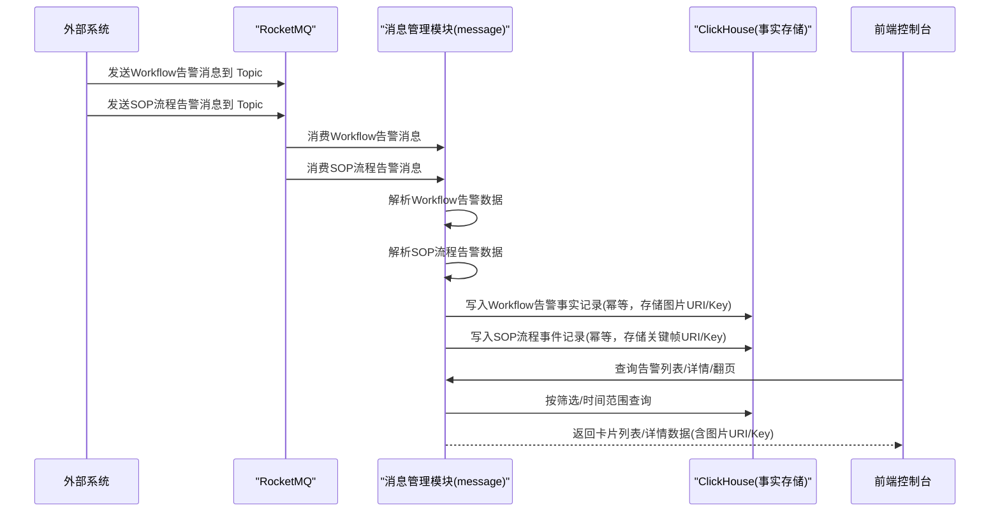
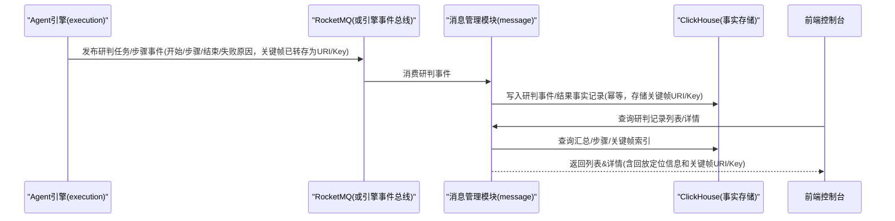
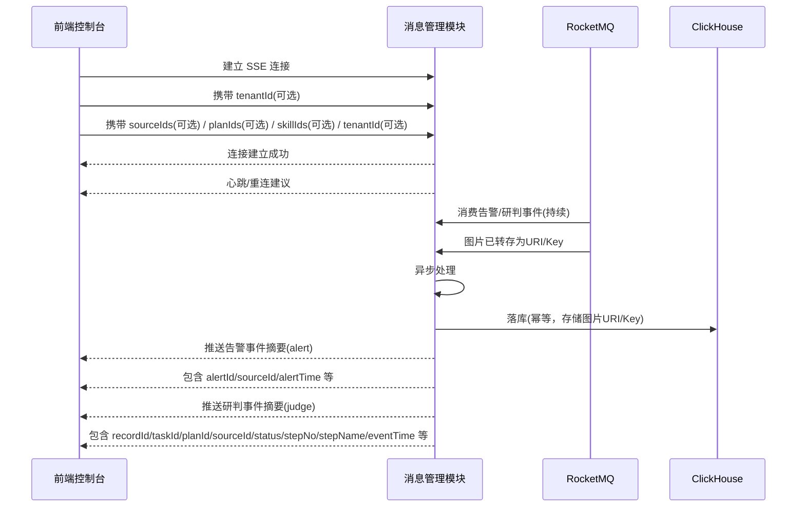

# 告警消息中心（Alert Message Center）技术侧概要设计说明书

> **负责人**：张海玉  
> **日期**：2026-03-10  
> **版本**：v1.0

---

## 1. 业务场景与范围

### 1.1 模块描述

告警消息中心负责在控制台中统一呈现"告警/异常事件"的列表、详情与处置联动能力，并支撑全链智判（智能研判）过程展示与研判记录复盘查询，同时提供告警数据订阅能力。

结合项目模块划分，后端承载模块建议落在 **消息管理模块** `com.megvii.agent.platform.message`（现有模块说明覆盖"事件告警、SOP 告警、消息接收"）。

### 1.2 核心功能（V1）

- **告警接入与落库**：本版本告警数据通过 **RocketMQ 接收并消费**，异步处理图片存储和数据落库(**数据存入ClickHouse**)。
  - 消息中的图片，该模块都需要统一转存
- **告警管理**：告警卡片列表查询、告警详情查询。
  - 可根据告警时间范围、计划名称（支持模糊查询）、技能名称、数据源编码列表（`sourceIds`）查询告警列表
  - 列表默认按照告警时间倒序排序
  - 列表数据项包含：事件ID、事件告警时间、通道名称/文件名称、通道编码/文件ID、技能名称、技能编码、任务计划名称、任务计划ID、告警图片URL(预签名带时效）
  - 详情数据：事件ID、事件告警时间、通道名称/文件名称、通道编码/文件ID、技能名称、技能编码、任务计划名称、任务计划ID、告警图片URL(预签名带时效）、告警目标列表Targets(Target包含Points也就是目标框，TargetScore目标得分也即是置信度，TargetType 目标类型）
- **实时推送（告警/研判）**：后端将"新产生的告警"与"研判/SOP 事件"以流式方式推送至前端，支撑前端实时展示（默认只推送摘要，详情仍走查询接口）。
- **全链智判-实时查看（展示）**：研判任务信息与 SOP 步骤状态（正常结束/异常结束/流程失败）展示数据查询。
  - 根据SOP计划及通道ID/文件ID, 实时查询当前进行的流程相关事件序列
  - 事件序列包含：
    - 实例开始 ：实例ID, 开始时间（SOP流程开始）
    - 步骤信息：步骤ID, 步骤名称，步骤状态，
      - 步骤开始：步骤开始时间
      - 步骤结束：结束时间、步骤耗时
      - 步骤跳步、未执行：没有步骤相关时间信息
      - 步骤超时： 超时间隔设置、步骤耗时
- **全链智判-研判记录（列表&详情）**：按时间/计划/技能检索历史研判任务；详情支持关键帧定位、步骤结果与失败原因定位。
  - 可根据时间范围、计划名称（支持模糊查询）、技能名称、数据源编码列表（`sourceIds`）、SOP状态 查询告警列表
  - 列表数据项包含：SSE记录开始时间&结束时间、计划名称、技能名称、通道名称/文件名称、通道编码/文件ID、SOP状态，SOP计划添加类型（手动添加 | 智能体添加）
  - SSE步骤详情：步骤名称、步骤状态、步骤开始时间、步骤结束时间、步骤耗时、步骤关键帧图片、步骤截图是否已保存、步骤超时设置
  - 详情数据：id、状态（流程状态）、技能名称、通道名称/文件名称、流程耗时（示例：00:12:30）、流程开始时间、流程结束时间、步骤列表(每个步骤包含如下信息：步骤顺序、步骤名称、步骤状态、步骤开始时间、步骤结束时间、步骤耗时、步骤截图是否已保存、步骤超时设置)

### 1.3 V1 边界

- 覆盖 产品功能需求和UE 中已体现的产品能力与交互
- 该版本只支持事件告警数据格式，对于目标结构化等数据格式暂不支持
- 权限控制、区域/组织隔离、告警来源对接方式等不在本次范围内，仅在字段中保留扩展信息（如 `regionCode`、`sourceSystem` 等）。
- 多租户能力在 V1 **仅做字段与过滤入口预留**（`tenantId/tenant_id`），不实现租户级权限与管理后台。
- 告警/SSE 与设备（通道）关联在 V1 **以** `**channelId/channel_id`** **为主键关联**；通道"实时状态/视频地址/组织归属"等来自其他模块（如数据模块）时，仅做字段冗余与跨模块查询预留。
- 该版本不实现"数据订阅推送"后台能力。

### 1.4 基础设施选型（V1 结论）

- **消息接入（告警）**：RocketMQ（本版本明确使用）
- **数据存储（告警数据 + SSE 研判事件/结果）**：ClickHouse（建议作为统一事实存储）
- **对象存储（关键帧/截图）**：S3（仅存引用 URL/Key）

---

## 2. 核心链路

### 2.1 告警接入 → 存储 → 查询（列表/详情）




**关键要点**

- **消息类型区分**：消息管理模块需区分Workflow告警数据和SOP流程告警数据，分别进行解析和处理。
- **幂等键**：
  - Workflow告警：使用 `id` 字段作为 `source_event_id`（外部事件唯一）
  - SOP流程告警：使用 `eventId` 或组合键作为幂等键
- **异步处理**：消息管理模块从MQ消费数据后，异步执行数据落库操作。
- **图片处理**：
  - 区分图片是URL还是Base64格式
  - 无论哪种格式，都转存到消息模块对应的对象存储
  - 存储图片URI/Key到ClickHouse
- **数据完整性**：通过异步重试机制确保数据落库成功，保证数据完整性。

### 2.2 研判事件沉淀 → 研判记录查询（列表/详情）




**关键要点**

- 告警消息中心只做"**事件沉淀与查询**"，编排执行由 `引擎` 负责。

### 2.3 实时推送（告警/研判事件）→ 前端实时展示




**关键要点**

- **推送与落库顺序**：默认"先落库成功，再推送摘要"，保证前端收到推送后可立刻用详情接口查询到数据；如需更低延迟可改为并行，但需处理前端短暂查不到详情的窗口（V1 不建议）。
- **推送粒度**：推送只包含"列表卡片/右侧实时列表可展示"的摘要字段；详情字段（图片大图、步骤明细、失败原因全文等）由原查询接口获取，避免推送包过大。
- **多租户预留**：实时连接建立时携带 `tenantId`（Header 或 query），服务端按 tenant 过滤推送事件；V1 允许 tenant 为空表示"单租户/默认租户"。
- **按 sourceId + 多维过滤订阅（实时监控页关键需求）**：
  - 未传任何过滤条件（`sourceIds/planIds/skillIds/tenantIds` 均为空）：服务端对该连接**全量推送**新产生的告警摘要（alert）与研判/SOP摘要（judge）。
  - 传了一个或多个过滤条件：服务端仅推送满足 `meta_data.sourceId`（对应 sourceIds）及其余维度（planId/skillId/tenantId，如非空）的新产生事件/告警摘要。
  - 动态订阅变更：前端关闭当前 SSE/WS 连接，携带新的 `sourceIds`、`planIds`、`skillIds`、`tenantIds` 参数重新建连，通过 `sinceTime` / `Last-Event-ID` 补偿断连期间漏推。
- **V1 验收口径（告警推送）**：V1 采用 SSE 作为实时推送接口，并确保"新告警产生后前端无需轮询即可实时收到摘要并刷新右侧列表"。

---

## 3. 接口契约

> 建议统一前缀：`/api/v1/datapool`

### 3.0 消息队列（RocketMQ）契约（V1）

- **订阅 Topic（告警接入）**：`T_AMC_workflow_event_IN`（Consumer，命名可按现网规范调整）
- **订阅 Topic（研判事件）**：`T_AMC_sop_EVENT_IN`（Consumer，命名可按现网规范调整）
- **消息幂等键**：
  - **Workflow 告警**：以消息体中的 `id` 为准，对应入库 `alert_id` / `source_event_id`（当前实现两者均写入同一 `id`）
  - 研判事件：`eventId`（优先）或 `recordId + stepNo + eventType + eventTime`

### 3.0.1 Workflow告警数据格式

**RocketMQ中存储格式**：JSON格式，数据结构与protobuf一致。

**存储形态建议（ClickHouse）**：采用**混合列**——`timestamp`（入库为 `alert_time`）、`id`、`image`（转存后为 `image_url`）等高频字段与排序键保持**扁平列**；`custom`、`meta_data`、`targets`、`tags` 以 **JSON 字符串列**落库，便于保留引擎侧完整结构与演进。**物化视图**从 `meta_data` 中抽取 `tenantId`、`sourceId`、`planId` 等字段供筛选与统计。


| 方案          | 优点                                | 缺点                                      |
| ----------- | --------------------------------- | --------------------------------------- |
| 全扁平         | 查询写法简单、部分场景无需 `JSONExtract`       | 与引擎 protobuf 演进耦合大，列变更成本高               |
| 全 JSON      | 扩展性最好                             | 过滤依赖函数与索引设计，查询与统计需额外物化视图                |
| **混合（本方案）** | 时间/主键/图片路径查询友好，业务扩展字段仍与引擎 JSON 对齐 | 需在写入时规范化 `meta_data`，并保持 MV 抽取字段与查询条件一致 |


**JSON示例（channel源）**：

```json
{
  "timestamp": 1678000000000,
  "id": "alert_001",
  "image": "http://example.com/image.jpg",
  "custom": {
    "key1": "value1",
    "key2": "value2"
  },
  "meta_data": {
    "planId": "plan_001",
    "planName": "日常巡检计划",
    "skillId": "skill_001",
    "skillName": "人员检测",
    "sourceType": "channel",
    "sourceId": "ch_001",
    "sourceName": "东南门通道",
    "tenantId": "abc_123"
  },
  "targets": [
    {
      "area_id": 1,
      "custom": {
        "key1": "value1"
      },
      "points": [
        {"x": 0.12, "y": 0.36},
        {"x": 0.45, "y": 0.36},
        {"x": 0.45, "y": 0.67},
        {"x": 0.12, "y": 0.67}
      ],
      "target_score": 0.95,
      "target_type": "person",
      "target_id": "target_001"
    }
  ],
  "tags": [
    {
      "target_id": "target_001",
      "tag": "person",
      "matched": true,
      "description": "人员检测"
    }
  ]
}
```

**JSON示例（file源）**：

```json
{
  "timestamp": 1678000000000,
  "id": "alert_001",
  "image": "http://example.com/image.jpg",
  "custom": {
    "key1": "value1",
    "key2": "value2"
  },
  "meta_data": {
    "planId": "plan_001",
    "planName": "日常巡检计划",
    "skillId": "skill_001",
    "skillName": "人员检测",
    "sourceType": "file",
    "sourceId": "file_001",
    "sourceName": "20260303_120000.mp4",
    "tenantId": "abc_123"
  },
  "targets": [
    {
      "area_id": 1,
      "custom": {
        "key1": "value1"
      },
      "points": [
        {"x": 0.12, "y": 0.36},
        {"x": 0.45, "y": 0.36},
        {"x": 0.45, "y": 0.67},
        {"x": 0.12, "y": 0.67}
      ],
      "target_score": 0.95,
      "target_type": "person",
      "target_id": "target_001"
    }
  ],
  "tags": [
    {
      "target_id": "target_001",
      "tag": "person",
      "matched": true,
      "description": "人员检测"
    }
  ]
}
```

**对应Protobuf结构**：

```protobuf
message Message {
  int64 timestamp = 1;
  string id = 2;
  string image = 3;
  google.protobuf.Value custom = 4;
  google.protobuf.Value meta_data = 5;
  repeated component.v1.TargetBox targets = 6;
  repeated component.v1.Tag tags = 7;
}

message Point {
  double x = 1;
  double y = 2;
}

message TargetBox {
  int32 area_id = 1;
  map<string, string> custom = 2;
  repeated Point points = 3;
  double target_score = 4;
  string target_type = 5;
  string target_id = 6;
}

message Tag {
  string target_id = 1;
  string tag = 2;
  bool matched = 3;
  string description = 4;
}
```

### 3.0.2 SOP流程告警数据格式

SOP流程告警数据格式由SOP引擎定义，包含流程执行状态、步骤信息等。

### 3.0.3 消息解析与映射

- **Workflow告警数据（JSON格式）**：
  - `timestamp` → `alert_time`（由毫秒时间戳转换为 `DateTime64(3)`）
  - `id` → `alert_id`；同时写入 `source_event_id`（与 `id` 相同，幂等与唯一约束）
  - `image` → 转存到对象存储，存储 URI/Key 到 `image_url`
  - `custom` → 完整序列化为 JSON 字符串写入 `custom` 列
  - `meta_data` → 入站可兼容历史字段名（如 `tenant_id`、`sourcelId`），**规范化后**写入 `meta_data` 列（统一为 `tenantId`、`sourceId`、`sourceName` 等）；并派生 `source_type` 列（来自 `meta_data.sourceType`）
  - `taskId` 兼容规则：优先使用 `meta_data.taskId`；若 `meta_data.taskId` 为空且顶层存在 `taskId`，则回填到 `meta_data.taskId` 后再落库
  - `targets` → JSON 字符串写入 `targets` 列
  - `tags` → JSON 字符串写入 `tags` 列
- **SOP流程告警数据**：
  - 按SOP引擎定义的格式解析，包含流程状态、步骤信息等
  - `meta_data` 中计划添加类型字段兼容 `planType`、`addType`、`plan_create_type`；统一映射到查询口径中的“添加类型”
  - 映射到 `sop_event` 表结构

### 3.0.4 多租户透传约定（预留）

- **推荐 Header**：`X-Tenant-Id`（若平台已有统一租户 Header，以平台规范为准）
- **适用范围**：HTTP 查询接口 + 实时推送（SSE / WebSocket）均可透传（见 §3.5）
- **V1 行为**：
  - 未传 `X-Tenant-Id`：按"默认租户/单租户"处理
  - 传 `X-Tenant-Id`：仅返回/推送该租户数据（过滤点在查询与推送层）

### 3.0.5 接口返回格式规范

- **成功响应格式**：
  ```json
  {
    "code": 0,
    "message": "success",
    "data": { /* 业务数据 */ }
  }
  ```
- **失败响应格式**：
  ```json
  {
    "code": "AMC_PARAM_INVALID",
    "message": "参数校验失败：pageSize 超过最大限制 100",
    "data": null
  }
  ```

### 3.1 告警管理

#### 3.1.1 告警列表（卡片流）

- **接口**：`POST /api/v1/datapool/alerts`
- **请求体**：

```json
{
  "sourceIds": ["ch_001", "ch_002"],
  "startTime": 1775015845,
  "endTime": 1775102243,
  "planName": "日常巡检",
  "skillIDs": ["skill001"],
  "pageNo": 1,
  "pageSize": 20
}
```


| 字段名         | 字段类型       | 是否必填 | 描述                                |
| ----------- | ---------- | ---- | --------------------------------- |
| `sourceIds` | `string[]` | 否    | 数据源编码列表（比如通道编码列表或者文件编码列表或者两者混合列表） |
| `startTime` | `string`   | 否    | 开始告警时间戳                           |
| `endTime`   | `string`   | 否    | 结束告警时间戳                           |
| `planName`  | `string`   | 否    | 计划名称（模糊匹配）                        |
| `skillIDs`  | `string[]` | 否    | 技能ID列表（可空）                        |
| `pageNo`    | `int`      | 否    | 默认 1                              |
| `pageSize`  | `int`      | 否    | 默认 20，建议不超过 100（前端展示限制）           |


**关键出参**


| 字段名                         | 字段类型     | 是否必填 | 描述                                                         |
| --------------------------- | -------- | ---- | ---------------------------------------------------------- |
| `alertMessages[].timestamp` | `bigint` | 是    | 毫秒时间戳，与 RocketMQ `timestamp` 一致                            |
| `alertMessages[].id`        | `string` | 是    | 告警 ID，与 RocketMQ `id` 一致                                   |
| `alertMessages[].image`     | `string` | 是    | 告警图片 URL（预签名），对应 RocketMQ `image` 经转存                      |
| `alertMessages[].custom`    | `object` | 否    | 与 RocketMQ `custom` 一致                                     |
| `alertMessages[].meta_data` | `object` | 否    | 与 RocketMQ `meta_data` 一致（计划/技能/租户/sourceType/channelId 等） |
| `alertMessages[].targets`   | `array`  | 否    | 与 RocketMQ `targets` 一致（结构见 §3.0.1）                        |
| `alertMessages[].tags`      | `array`  | 否    | 与 RocketMQ `tags` 一致                                       |
| `pagination.total`          | `long`   | 是    | 总记录数                                                       |
| `pagination.pageNo`         | `int`    | 是    | 当前页码                                                       |
| `pagination.pageSize`       | `int`    | 是    | 每页大小                                                       |
| `pagination.totalPages`     | `int`    | 是    | 总页数                                                        |


**响应示例**：

```json
{
  "code": 0,
  "message": "success",
  "data": {
    "alertMessages": [
      {
        "timestamp": 1678000000000,
        "id": "alert_001",
        "image": "http://example.com/full.jpg?presigned=xxx&expires=1234567890",
        "custom": {
          "key1": "value1",
          "key2": "value2"
        },
        "meta_data": {
          "planId": "plan_001",
          "planName": "日常巡检计划",
          "skillId": "skill_001",
          "skillName": "人员检测",
          "sourceType": "channel",
          "sourceId": "ch_001",
          "sourceName": "东南门通道",
          "tenantId": "abc_123"
        },
        "targets": [],
        "tags": []
      },
      {
        "timestamp": 1677999000000,
        "id": "alert_002",
        "image": "http://example.com/full2.jpg?presigned=xxx&expires=1234567890",
        "custom": {
          "key1": "value1",
          "key2": "value2"
        },
        "meta_data": {
          "planId": "plan_002",
          "planName": "视频分析计划",
          "skillId": "skill_001",
          "skillName": "人员检测",
          "sourceType": "file",
          "sourceId": "file_001",
          "sourceName": "20260303_120000.mp4",
          "tenantId": "abc_123"
        },
        "targets": [],
        "tags": []
      }
    ],
    "pagination": {
      "total": 100,
      "pageNo": 1,
      "pageSize": 20,
      "totalPages": 5
    }
  }
}
```

#### 3.1.2 告警详情

- **接口**：`GET /api/v1/datapool/alerts/{alertId}`
- **关键出参**：与 RocketMQ Workflow 消息体一致（`timestamp`、`id`、`image`、`custom`、`meta_data`、`targets`、`tags`）；业务侧展示信息（计划/技能/通道/文件等）从 `**meta_data`** 读取。

**响应示例**：

```json
{
  "code": 0,
  "message": "success",
  "data": {
    "timestamp": 1678000000000,
    "id": "alert_001",
    "image": "http://example.com/full.jpg?presigned=xxx&expires=1234567890",
    "custom": {
      "key1": "value1",
      "key2": "value2"
    },
    "meta_data": {
      "planId": "plan_001",
      "planName": "日常巡检计划",
      "skillId": "skill_001",
      "skillName": "人员检测",
      "sourceType": "channel",
      "sourceId": "ch_001",
      "sourceName": "东南门通道",
      "tenantId": "abc_123"
    },
    "targets": [
      {
        "area_id": 1,
        "points": [
          {"x": 0.12, "y": 0.36},
          {"x": 0.45, "y": 0.36}
        ],
        "target_score": 0.95,
        "target_type": "person",
        "target_id": "target_001"
      }
    ],
    "tags": []
  }
}

**文件类型告警详情示例**：

```json
{
  "code": 0,
  "message": "success",
  "data": {
    "timestamp": 1677999000000,
    "id": "alert_002",
    "image": "http://example.com/full2.jpg?presigned=xxx&expires=1234567890",
    "custom": {
      "key1": "value1",
      "key2": "value2"
    },
    "meta_data": {
      "planId": "plan_002",
      "planName": "视频分析计划",
      "skillName": "人员检测",
      "skillId": "skill_001",
      "sourceType": "file",
      "sourceId": "file_001",
      "sourceName": "20260303_120000.mp4",
      "tenantId": "abc_123"
    },
    "targets": [
      {
        "area_id": 1,
        "custom": {
          "key1": "value1",
          "key2": "value2"
        },
        "points": [
          {"x": 150, "y": 150},
          {"x": 250, "y": 150},
          {"x": 250, "y": 250},
          {"x": 150, "y": 250}
        ],
        "target_score": 0.92,
        "target_type": "person",
        "target_id": "target_002"
      }
    ],
    "tags": []
  }
}
```

### 3.2 实时监控右侧告警列表联动

- **今日告警**：使用 `3.1.1` 告警列表接口，设置 `startTime` 为当天开始时间，`endTime` 为当天结束时间即可
- **历史告警入口**：前端跳转复用 `3.1.1` 告警列表接口（筛选条件不同即可）

### 3.4 全链智判 - 研判记录（列表 & 详情）

#### 3.4.1 研判记录列表

- **接口**：`POST /api/v1/datapool/judgement/records`
- **请求体**：

```json
{
  "sourceType": "channel",
  "startTime": "2026-03-01 00:00:00",
  "endTime": "2026-03-31 23:59:59",
  "planName": "日常巡检",
  "skillIDs": ["skill001", "skill002"],
  "channelIDs": ["ch_001", "ch_002"],
  "fileIDs": ["file_001", "file_002"],
  "statusList": ["passed", "failed", "running"],
  "sortBy": "startTime",
  "sortOrder": "desc",
  "pageNum": 1,
  "pageSize": 20
}
```

- **筛选项**：起止时间、计划名称(可模糊查询)、技能编码列表、来源类型、通道编码列表、文件编码列表、SSE状态列表；支持设置排序，默认按告警时间倒序；分页
- **分页字段**：请求体优先使用 **`pageNum`**；兼容 JSON 字段 **`pageNo`**（与工程 `PageResult` 的 `pageNum`/`pageNo` 别名策略一致）
- **响应体**：统一为 **`Result<PageResult<JudgeRecord>>`**，分页字段为 **`list`、`total`、`pageNum`、`pageSize`**（与 [`PageResult`](../../../src/main/java/com/megvii/agent/platform/common/model/PageResult.java) 一致）；下列「关键出参」表格描述的是列表元素与分页的语义对照，字段名以实际 DTO 为准
- **计划添加类型字段口径**：对外主字段为 **`addType`**；兼容字段 **`planCreateType`** 与其同值回填；入站兼容 `meta_data.planType`、`meta_data.addType`、`meta_data.plan_create_type`

**关键出参**


| 字段名                          | 字段类型      | 是否必填 | 描述                           |
| ---------------------------- | --------- | ---- | ---------------------------- |
| `list[].recordId`            | `string`  | 是    | 研判记录 ID（实例 ID）                |
| `list[].planName`            | `string`  | 是    | 计划名称                         |
| `list[].skillName`           | `string`  | 是    | 技能名称                         |
| `list[].startTime`           | `string`  | 是    | 开始时间                         |
| `list[].endTime`             | `string`  | 是    | 结束时间                         |
| `list[].status`              | `string`  | 是    | 状态                           |
| `list[].sourceType`          | `string`  | 是    | 来源类型（channel/file）           |
| `list[].sourceId`            | `string`  | 是    | 数据源 ID（通道或文件统一标识）            |
| `list[].sourceName`          | `string`  | 是    | 数据源名称（通道名或文件名）             |
| `list[].addType`             | `string`  | 是    | 添加类型（手动添加/智能体添加）             |
| `total`                      | `long`    | 是    | 总记录数（`PageResult`）              |
| `pageNum`                    | `int`     | 是    | 当前页码；反序列化可写 `pageNo`         |
| `pageSize`                   | `int`     | 是    | 每页大小                          |
| `list`                       | `array`   | 是    | 当前页研判记录列表（元素即 `JudgeRecord`） |


**响应示例**：

```json
{
  "code": 0,
  "message": "success",
  "data": {
    "list": [
      {
        "recordId": "record_001",
        "planName": "装配线作业流程",
        "skillName": "装配检测",
        "sourceType": "channel",
        "sourceId": "ch_001",
        "sourceName": "维修工位1号",
        "startTime": "2026-02-10 09:30",
        "endTime": "2026-02-12 09:30",
        "status": "异常结束",
        "addType": "手动添加"
      },
      {
        "recordId": "record_002",
        "planName": "装配线作业流程1",
        "skillName": "装配检测",
        "sourceType": "channel",
        "sourceId": "ch_002",
        "sourceName": "维修工位2号",
        "startTime": "2026-02-10 09:30",
        "endTime": "2026-02-12 09:30",
        "status": "流程失败",
        "addType": "手动添加"
      },
      {
        "recordId": "record_003",
        "planName": "视频分析流程",
        "skillName": "人员检测",
        "sourceType": "file",
        "sourceId": "file_001",
        "sourceName": "20260303_120000.mp4",
        "startTime": "2026-03-03 12:00:00",
        "endTime": "2026-03-03 12:05:00",
        "status": "正常结束",
        "addType": "智能体添加"
      }
    ],
    "total": 50,
    "pageNum": 1,
    "pageSize": 20
  }
}
```

#### 3.4.2 研判记录详情

- **接口**：`GET /api/v1/datapool/judgement/records/{recordId}`
- **关键出参**：
  - 基础信息：id、status（流程状态）、技能名称、`sourceType/sourceId/sourceName`、流程耗时（示例：00:12:30）、流程开始时间、流程结束时间
  - 步骤列表：步骤顺序、步骤名称、步骤状态、步骤开始时间、步骤结束时间、步骤耗时、步骤截图是否已保存、步骤超时设置

**响应示例**：

```json
{
  "code": 0,
  "message": "success",
  "data": {
    "id": "record_001",
    "status": "passed",
    "skillName": "人员检测",
    "sourceType": "channel",
    "sourceId": "ch_001",
    "sourceName": "东南门通道",
    "duration": "00:00:07",
    "startTime": "2026-03-03 13:13:13",
    "endTime": "2026-03-03 13:13:20",
    "steps": [
      {
        "stepNo": 1,
        "stepName": "图像采集",
        "status": "passed",
        "startTime": "2026-03-03 13:13:13",
        "endTime": "2026-03-03 13:13:14",
        "duration": "00:00:01",
        "screenshotSaved": true,
        "timeoutSetting": "60s"
      },
      {
        "stepNo": 2,
        "stepName": "人员识别",
        "status": "passed",
        "startTime": "2026-03-03 13:13:14",
        "endTime": "2026-03-03 13:13:18",
        "duration": "00:00:04",
        "screenshotSaved": true,
        "timeoutSetting": "120s"
      }
    ]
  }
}

**文件类型研判记录详情示例**：

```json
{
  "code": 0,
  "message": "success",
  "data": {
    "id": "record_003",
    "status": "正常结束",
    "skillName": "人员检测",
    "sourceType": "file",
    "sourceId": "file_001",
    "sourceName": "20260303_120000.mp4",
    "duration": "00:05:00",
    "startTime": "2026-03-03 12:00:00",
    "endTime": "2026-03-03 12:05:00",
    "steps": [
      {
        "stepNo": 1,
        "stepName": "视频分析",
        "status": "passed",
        "startTime": "2026-03-03 12:00:00",
        "endTime": "2026-03-03 12:03:00",
        "duration": "00:03:00",
        "screenshotSaved": true,
        "timeoutSetting": "300s"
      },
      {
        "stepNo": 2,
        "stepName": "结果生成",
        "status": "passed",
        "startTime": "2026-03-03 12:03:00",
        "endTime": "2026-03-03 12:05:00",
        "duration": "00:02:00",
        "screenshotSaved": false,
        "timeoutSetting": "60s"
      }
    ]
  }
}
```

### 3.4.3 告警统计（Workflow / SOP）

#### 3.4.3.1 Workflow 告警数据统计

- **接口**：`GET /api/v1/datapool/statistics/workflow`
- **入参（query）**：
  - `planId`：计划 ID
  - `skillId`：技能 ID
  - `sourceId`：数据源 ID
  - `startTime`：开始时间
  - `endTime`：结束时间

#### 3.4.3.2 SOP 解析结果统计

- **接口**：`GET /api/v1/datapool/statistics/sop`
- **入参（query）**：
  - `planId`：计划 ID
  - `skillId`：技能 ID
  - `sourceId`：数据源 ID
  - `startTime`：开始时间
  - `endTime`：结束时间

#### 3.4.3.3 按维度组合统计

- **接口**：`GET /api/v1/datapool/statistics/group`
- **入参（query）**：
  - `dataSource`：数据源（可选，默认 `workflow`）
    - `workflow`：聚合表 **`workflow_event`**，时间列 **`timestamp`**
    - `sop`：聚合表 **`sop_instance`**，筛选与分组中的「日」维度按实例 **`start_time`**
  - `planId`：计划 ID（可选）
  - `skillId`：技能 ID（可选）
  - `sourceId`：数据源 ID（可选）；两路均映射底层列 **`source_id`**
  - `taskId`：任务 ID（可选）；两路均映射底层列 **`task_id`**
  - `startTime`：开始时间（可选，ISO8601 等可被 ClickHouse `parseDateTime64BestEffortOrNull` 解析的字符串）
  - `endTime`：结束时间（可选）；**`sop`** 时与列表接口一致，时间范围按实例 **`start_time`** 过滤
  - `groupBy`：分组字段（必填），多个字段用逗号分隔；**仅允许**：`plan_id`、`skill_id`、`source_id`、`task_id`、`alert_date`（`alert_date` 在 workflow 侧为 `toDate(timestamp)`，在 sop 侧为 `toDate(start_time)`）

#### 3.4.4 数据保留策略（ClickHouse + 对象存储）

- **接口**：`GET /api/v1/datapool/retention` — 查询 ClickHouse 四张表（`workflow_event`、`sop_event`、`sop_instance`、`sop_node_event`）TTL 解析结果，以及告警图片桶 Lifecycle 规则中的过期天数；出参字段与实现见 `MessageDataRetentionVO`。
- **接口**：`PUT /api/v1/datapool/retention` — 调整保留天数：
  - **兼容**：请求体 `retentionDays`（ClickHouse 与对象存储使用同一天数）；
  - **可选拆分**：`clickhouseRetentionDays`、`objectStorageRetentionDays`（可分别设置；只传一侧时另一侧默认继承同值；**不得**与 `retentionDays` 同时传入）。
- **ClickHouse**：对四张表执行 `MODIFY TTL`；物化视图定义无需随 TTL 变更而修改（详见 §4.4）。
- **对象存储**：更新告警图片 bucket 上受管 Lifecycle 规则（规则 ID、整桶/前缀等见 `common.yaml` 中 `megvii.s3.alert-image.*`）。
- **运维一次性对齐**：存量库可直接执行的 `ALTER TABLE ... MODIFY TTL` 与核对方式见 **§4.4**。

### 3.5 实时推送（SSE）

> 目标：前端"实时展示新的告警数据/研判数据"，减少轮询频率；**V1 必须实现告警实时推送**（SSE），推送摘要，详情走查询接口。

#### 3.5.1 SSE / WebSocket（服务端推送）

Workflow 与 SOP **分通道**，互不混流，便于开发与测试隔离。

- **Workflow 告警 SSE**：`GET /api/v1/datapool/stream/workflow`（仅 `alert` + 心跳）
- **SOP 研判 SSE**：`GET /api/v1/datapool/stream/sop`（仅 `judge` + 心跳）
- **WebSocket（仅 Workflow 告警）**：`ws(s)://{host}/api/v1/datapool/ws/stream`（查询参数与 **Workflow SSE** 过滤字段一致，不含 SOP 专用逻辑）
- **能力说明（HTTP）**：`GET /api/v1/datapool/stream/capabilities`

**入参（query，两路 SSE 共用字段语义）**

| 字段名         | 字段类型     | 是否必填 | 描述                                                                                           |
| ----------- | -------- | ---- | -------------------------------------------------------------------------------------------- |
| `sourceIds` | `string` | 否    | 关注数据源集合（sourceId），逗号分隔（如 `src1,src2`）；**不传/为空=默认全量推送**；传值=仅推送该集合 sourceId 产生的告警/事件           |
| `planIds`   | `string` | 否    | 关注计划集合，逗号分隔（如 `plan1,plan2`）；**不传/为空=默认全量推送**；传值=仅推送该集合计划产生的告警/事件                         |
| `skillIds`  | `string` | 否    | 关注技能集合（skillId），逗号分隔（如 `skill1,skill2`）；**不传/为空=默认全量推送**；传值=仅推送该集合 skillId 产生的告警/事件          |
| `tenantIds` | `string` | 否    | 关注租户集合（tenantId），逗号分隔（如 `tenant1,tenant2`）；**不传/为空=默认全量推送**；传值=仅推送该集合 tenantId 产生的告警/事件      |
| `sinceTime` | `long`   | 否    | 客户端重连补偿起点，**UTC 毫秒时间戳**；预留用于断开重连后的历史回补（实现随版本迭代）                                  |


- **返回**：SSE 为 `text/event-stream`；WebSocket 为 **文本帧**，每条业务消息为完整 JSON 字符串。
- **Workflow 告警载荷**：与 RocketMQ Workflow 消息体一致，字段为 `timestamp`（毫秒）、`id`、`image`（预签名 URL）、`custom`、`meta_data`、`targets`、`tags`（与 §3.0.1 一致）。
- **SSE 事件名**：
  - **Workflow 通道**（`/stream/workflow`）：`event: alert`（`data` 为上述 JSON 字符串）、`event: heartbeat`
  - **SOP 通道**（`/stream/sop`）：`event: judge`（研判 / SOP 事件包装 JSON，非 RocketMQ Workflow 形态）、`event: heartbeat`
- **WebSocket**：仅推送 Workflow 告警；连接成功可先收到 `{"type":"connect","message":"ok"}`；心跳 JSON 与 SSE 一致；客户端可发文本 `ping` 服务端回复 `{"type":"pong","timestamp":...}`。

**SSE 推送示例（alert）**：

```
event: alert
data: {"timestamp":1678000000000,"id":"alert_001","image":"https://...","custom":{},"meta_data":{"sourceType":"channel","sourceId":"ch_001","planId":"plan_001","skillId":"skill_001","tenantId":"abc_123"},"targets":[],"tags":[]}


event: alert
data: {"timestamp":1677999000000,"id":"alert_002","image":"https://...","custom":{},"meta_data":{"sourceType":"file","sourceId":"file_001","planId":"plan_002","skillId":"skill_002","tenantId":"abc_456"},"targets":[],"tags":[]}


event: judge
data: {"recordId":"record_001","taskId":"task_001","planId":"plan_001","sourceType":"channel","sourceId":"ch_001","sourceName":"东南门通道","status":"running","stepNo":2,"stepName":"人员识别","eventTime":"2026-03-03 13:13:14"}


event: judge
data: {"recordId":"record_003","taskId":"task_003","planId":"plan_003","sourceType":"file","sourceId":"file_001","sourceName":"20260303_120000.mp4","status":"running","stepNo":1,"stepName":"视频分析","eventTime":"2026-03-03 12:00:00"}


event: heartbeat
data: {"type":"heartbeat","timestamp":1712134567890}
```

#### 3.5.2 动态订阅变更（source/计划/技能/租户集合切换）

- **方式**：断开重连——前端关闭当前 `EventSource` 或 **WebSocket**，用新的 `types`、`sourceIds`、`planIds`、`skillIds` 和 `tenantIds` 参数重新建连。
- **漏推补偿**：重连时携带 `sinceTime`（上次收到消息的时间戳）或 `Last-Event-ID`，服务端补推断连期间的消息。
- **说明**：Workflow 告警同时支持 **SSE** 与 **WebSocket**；订阅范围规则一致（`sourceIds/planIds/skillIds/tenantIds` 均为空则全量）。

### 3.6 错误码（示例）

- `AMC_PARAM_INVALID`：参数校验失败（时间范围非法、`pageSize` 过大、订阅类型非法、`sourceIds/skillIds/tenantIds` 格式非法或超过上限、`planIds` 格式非法或超过上限等）
- `AMC_ALERT_NOT_FOUND`：告警不存在
- `AMC_RECORD_NOT_FOUND`：研判记录不存在
- `AMC_STORAGE_ERROR`：存储/查询异常
- `AMC_STREAM_ERROR`：实时连接异常（SSE 建连失败或服务端主动断开）
- `AMC_SUBSCRIPTION_NOT_FOUND`：订阅规则不存在
- `AMC_PUSH_ERROR`：推送失败

---

## 4. 数据模型

### 4.1 告警事实数据（ClickHouse）

**表名**：`workflow_event`（Workflow 告警唯一事实表）

核心思路：**主键排序列承载高频筛选维度**（租户 / 计划 / 技能 / 数据源 / 时间），`meta_data` 仍保留完整 JSON 作为扩展兜底；`custom`、`targets`、`tags` 为原始 JSON 字符串列。


| 列名                                         | 类型（实现）                   | 描述                    |
| ------------------------------------------ | ------------------------ | --------------------- |
| `timestamp`                                | `DateTime64(3)`          | 告警时间                  |
| `id`                                       | `String`                 | 业务主键，对应 RocketMQ `id` |
| `image`                                    | `String`                 | 图片 Key 或 URL（转存后）     |
| `custom`                                   | `String`                 | 业务自定义 JSON            |
| `tenant_id`                                | `LowCardinality(String)` | 租户，初期可为空串             |
| `plan_id`                                  | `LowCardinality(String)` | 计划 ID                 |
| `skill_id`                                 | `LowCardinality(String)` | 技能 ID                 |
| `source_id`                                | `String`                 | 数据源 ID（通道或文件统一标识）     |
| `source_type`                              | `LowCardinality(String)` | `channel` / `file`    |
| `plan_name` / `skill_name` / `source_name` | `String`                 | 展示列                   |
| `meta_data`                                | `String`                 | 完整 meta JSON          |
| `targets` / `tags`                         | `String`                 | 明细 JSON（仅展示）          |


- **分区**：`PARTITION BY toYYYYMM(timestamp)`
- **排序**：`ORDER BY (tenant_id, plan_id, skill_id, source_id, timestamp)`
- **跳数索引**：`id`、`source_id`（Bloom filter）
- **TTL**：默认 180 天（以仓库 `docker/init/clickhouse-init/V1__init.sql` 为准，可通过保留策略接口或运维 SQL 调整；对齐说明见 §4.4）
- **统计物化视图**：`amc_alert_statistics_mv` 基于 `workflow_event` 聚合，统计接口统一支持 `source_id` 与 `task_id` 维度字段

完整 DDL 见仓库 `docker/init/clickhouse-init/V1__init.sql`。

### 4.2 SSE 研判事件/结果（ClickHouse）

SOP 合规告警采用 **方案 B：append-only + Materialized View 聚合**。

**表设计（实现）**
- `sop_event`：事件事实表，只做追加写入，保存标准化事件 + 原始 payload。
- `sop_instance`：实例查询表，列表/统计主查询表。
- `sop_node_event`：步骤查询表，详情步骤主查询表。
- `mv_sop_event_to_instance`：从事件表聚合实例查询数据。
- `mv_sop_event_to_node`：从事件表聚合节点查询数据。

**设计原则**
- 禁止使用高频行级 `UPDATE/DELETE` 维护实时状态。
- 事件去重在写入侧通过 `event_id`（或组合键）控制。
- 列表、详情、统计统一读取快照表，避免在线聚合原始事件。
- `node_end.frame_urls` 转存后仅保存对象存储 key 列表。

完整 DDL 见仓库 `docker/init/clickhouse-init/V1__init.sql`。

### 4.3 告警订阅规则（ClickHouse）

**表名（建议）**：`amc_alert_subscription`


| 列名                      | 字段类型（建议）        | 描述                   |
| ----------------------- | --------------- | -------------------- |
| `subscription_id`       | `String`        | 订阅规则 ID              |
| `name`                  | `String`        | 订阅规则名称               |
| `description`           | `String`        | 订阅规则描述               |
| `task_ids`              | `String`        | 订阅的任务 ID 列表（JSON 格式） |
| `channel_ids`           | `String`        | 订阅的通道 ID 列表（JSON 格式） |
| `alert_types`           | `String`        | 订阅的告警类型列表（JSON 格式）   |
| `notification_channels` | `String`        | 通知渠道列表（JSON 格式）      |
| `status`                | `String`        | 状态（active/inactive）  |
| `created_at`            | `DateTime64(3)` | 创建时间                 |
| `updated_at`            | `DateTime64(3)` | 更新时间                 |


**表结构实现（ClickHouse SQL）**：

```sql
CREATE TABLE amc_alert_subscription (
    subscription_id String,
    name String,
    description String,
    task_ids String,
    channel_ids String,
    alert_types String,
    notification_channels String,
    status String,
    created_at DateTime64(3),
    updated_at DateTime64(3)
) ENGINE = MergeTree()
PARTITION BY toDate(created_at)
ORDER BY (subscription_id)
PRIMARY KEY (subscription_id);
```

### 4.4 数据保留策略与运维对齐（ClickHouse + 对象存储）

**产品侧（HTTP）**

- `GET /api/v1/datapool/retention`：查询 ClickHouse 四张表（`workflow_event`、`sop_event`、`sop_instance`、`sop_node_event`）当前 TTL 解析结果，以及告警图片桶生命周期规则中的过期天数（实现见 `MessageRetentionController`）。
- `PUT /api/v1/datapool/retention`：调整保留天数；兼容入参 `retentionDays`（ClickHouse 与对象存储同值），或分别传入 `clickhouseRetentionDays`、`objectStorageRetentionDays`（只传一侧时另一侧默认继承同值）。ClickHouse 侧会对上述四张表执行 `MODIFY TTL`；对象存储侧更新受管 bucket 的 Lifecycle 规则（与 `megvii.s3.alert-image.lifecycle-rule-id` 等配置一致）。

**物化视图**：`mv_sop_event_to_instance`、`mv_sop_event_to_node` 仅负责增量聚合写入目标表，**无需因 TTL 调整而修改 MV 定义**；生命周期由**目标表**（`sop_instance`、`sop_node_event`）及事实表（`sop_event`）上的 TTL 控制。

**运维侧（存量环境一次性对齐 ClickHouse TTL）**

适用于新建库已随 DDL 带 TTL、但**线上历史库**尚未执行过与实现一致的 `MODIFY TTL`，或需与控制台策略手工对齐时。将库名、保留天数替换为实际值后在 ClickHouse 执行（表达式与 `WorkflowAlertRetentionServiceImpl` 中下发逻辑一致）：

```sql
-- 与配置 megvii.clickhouse.database / MEGVII_CLICKHOUSE_DATABASE 一致
USE agent_platform;

ALTER TABLE workflow_event
MODIFY TTL toDateTime(`timestamp`) + INTERVAL 30 DAY DELETE;

ALTER TABLE sop_event
MODIFY TTL toDateTime(event_time) + INTERVAL 30 DAY DELETE;

ALTER TABLE sop_instance
MODIFY TTL toDateTime(start_time) + INTERVAL 30 DAY DELETE;

ALTER TABLE sop_node_event
MODIFY TTL toDateTime(ifNull(coalesce(step_start_time, step_end_time), toDateTime64(0, 3))) + INTERVAL 30 DAY DELETE;
```

**执行后核对**：

```sql
SHOW CREATE TABLE workflow_event;
SHOW CREATE TABLE sop_event;
SHOW CREATE TABLE sop_instance;
SHOW CREATE TABLE sop_node_event;
```

确认各表 DDL 中出现期望的 `INTERVAL <N> DAY`。若表名与默认不一致，以环境变量 / Nacos 中 `megvii.clickhouse.alerts-table`、`megvii.clickhouse.sop-event-table`、`megvii.clickhouse.sop-instance-table`、`megvii.clickhouse.sop-node-event-table` 为准替换 `ALTER` 中的表名。

**对象存储**：告警图片桶生命周期仍通过上述 `PUT .../retention` 或对象存储控制台配置；专桶与前缀模式见 `common.yaml` 中 `megvii.s3.alert-image.lifecycle-whole-bucket`、`megvii.s3.object-prefix.alert-image` 说明。

---

## 5. 稳定性与异常处理

### 5.1 幂等方案

- **告警接入**：以 `source_event_id`（外部唯一）或 `alert_id` 作为幂等键，RocketMQ 重投/重复投递不重复落库。
- **研判事件消费**：以"引擎事件唯一ID"或组合键（如 `recordId + stepNo + eventType + eventTime`）做幂等，保障重复消息不会污染状态。

### 5.2 重试逻辑

- **MQ 消费失败**：按消息中间件重试策略处理；超过阈值进入死信/告警（V1 仅设计预留）。
- **存储短暂不可用**：接口返回 `AMC_STORAGE_ERROR`，并记录日志与指标便于定位。
- **接口调用失败**：实现客户端重试机制，对临时性故障进行有限次数的重试。
- **推送失败**：对多渠道推送失败的情况，实现重试机制，确保消息送达。

### 5.3 限流/降级

- **列表查询建议**：建议 `pageSize` 不超过 100，以保证查询性能。
- **依赖不可用**：不返回伪数据，保持失败语义清晰，返回明确的错误码。
- **SSE 连接限制**：每个客户端最多维持一个 SSE 连接，超过限制将拒绝新连接。
- **推送频率限制**：对多渠道推送设置频率限制，防止过度推送。

### 5.4 性能优化

- **查询优化**：
  - 利用 ClickHouse 排序键和分区键优化查询性能
  - 对常用查询场景创建物化视图，加速查询
  - 避免全表扫描，使用索引覆盖查询
- **缓存策略**：
  - 对热点数据（如设备信息）使用 Redis 缓存
  - 对频繁访问的告警列表进行缓存，设置合理的过期时间
- **批量处理**：
  - MQ 消息消费采用批量处理，减少数据库写入次数
  - 接口返回数据采用分页，避免一次性返回大量数据
- **并行处理**：
  - 对独立的查询任务采用并行处理，提高响应速度

### 5.5 监控与日志

- **监控指标**：
  - **消息消费指标**：消费延迟、消费速率、失败率
  - **存储指标**：存储使用率、写入延迟、查询响应时间
  - **接口指标**：接口调用量、响应时间、错误率
  - **SSE 指标**：连接数、推送延迟、重连次数
- **日志记录**：
  - **业务日志**：记录关键业务操作，如告警接入、研判事件处理
  - **错误日志**：记录系统异常、外部依赖失败等错误信息
  - **审计日志**：记录重要操作的执行情况，便于追溯
- **告警机制**：
  - 当消息消费延迟超过阈值时触发告警
  - 当存储使用率超过阈值时触发告警
  - 当接口错误率超过阈值时触发告警

### 5.6 模块交互

- **与设备管理模块**：
  - 通过 `channel_id` 关联设备信息
  - 可选：调用设备管理接口获取设备详细信息
  - 建议：在告警事实表中冗余 `channel_name`、`channel_code` 等常用字段，减少跨模块调用
- **与视频服务模块**：
  - 通过 `channel_id` 关联视频流地址
  - 支持从告警详情跳转到视频实时播放
  - 支持从研判记录跳转到视频回放
- **与引擎模块**：
  - 接收引擎产生的研判事件
  - 为引擎提供告警数据查询能力
- **与前端模块**：
  - 提供 RESTful API 接口
  - 提供 SSE 实时推送接口
  - 支持前端动态订阅通道集合

---

## 6. 技术预留

- **MQ 扩展**：本版本以 RocketMQ 作为告警接入来源；如后续需要同时支持 HTTP/Kafka 等多来源，可在"接入层"扩展多适配器并统一落 ClickHouse。
- **事实存储扩展**：本版本统一落 ClickHouse；如后续需要冷热分层（RDB 索引 + ClickHouse 事实），可新增汇总索引表与异步同步机制（非 V1 范围）。
- **权限/区域隔离**：接口与表结构预留 `tenantId/regionCode/orgId/sourceSystem` 等字段，V1 不实现隔离逻辑。
- **设备信息关联**：以 `channel_id` 作为与设备档案关联的主键；如需要展示更丰富设备信息（在线状态、所属组织、经纬度、视频拉流参数等），建议通过数据模块提供的设备查询接口补全，或在告警事实表中按需冗余 `channel_name/channel_code` 等检索字段，避免每次列表都跨模块 Join。
- **高级订阅规则**：预留支持更复杂的订阅规则，如基于告警级别、时间范围等条件的订阅（非 V1 范围）。
- **实时分析**：预留支持告警数据实时分析和统计功能（非 V1 范围）。

