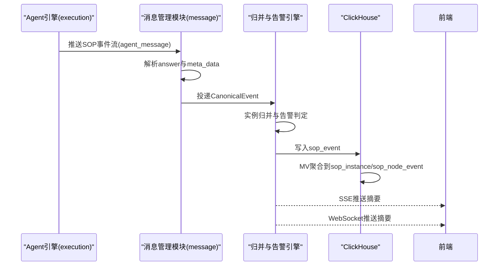

# SOP 合规告警模块概要设计（V2）

> **负责人**：张海玉  
> **日期**：2026-04-14  
> **版本**：v2.0

---

## 1. 业务场景与范围

### 1.1 模块描述

SOP 合规告警模块负责将 SOP 流式事件转化为可查询、可推送、可告警的统一业务模型，支撑实时监控、研判记录与异常告警。

本版本明确：

- 不做历史兼容
- 重建 ClickHouse 模型
- 双通道实时推送（SSE + WebSocket）
- 实例状态与上游 `instance_end.status` 强一致

### 1.2 核心功能

- **统一事件标准化**：将原始 `agent_message.answer` 解析为 Canonical Event
- **实例归并**：按 `instanceId` 聚合事件，并直接使用 `instance_end.status`
- **告警判定**：节点异常与实例异常统一规则化触发
- **三表存储**：`sop_event`、`sop_instance`、`sop_node_event` 支撑主链路
- **实时订阅推送**：按订阅条件过滤并推送到 SSE/WebSocket

---

## 2. 核心链路

### 2.1 主链路时序

### 2.2 关键补充

- 先标准化再执行业务判定，避免字符串 JSON 在业务层传播。
- 快照由归并服务统一生成，查询层不再重复拼接逻辑。
- 推送只下发摘要，详情走查询接口。

---

## 3. 领域模型设计

### 3.1 Canonical Event 模型

| 字段名 | 字段类型 | 是否必填 | 描述 |
| --- | --- | --- | --- |
| `eventId` | `string` | 否 | 强幂等事件键（仅核心事件要求，如 `node_end/instance_end`） |
| `dedupKey` | `string` | 否 | 分级去重键（辅助事件可为空或短窗口弱去重） |
| `eventType` | `string` | 是 | `sop_start/instance_start/node_start/node_end/instance_end/sop_end` |
| `eventTime` | `datetime` | 是 | 事件业务时间 |
| `instanceId` | `string` | 否 | SOP 实例 ID，节点与实例事件必填 |
| `nodeId` | `int` | 否 | 节点 ID，节点事件必填 |
| `nodeStatus` | `string` | 否 | 节点状态：`success/skip/redo/timeout/failed` |
| `planId` | `string` | 否 | 计划 ID |
| `skillId` | `string` | 否 | 技能 ID |
| `sourceType` | `string` | 否 | 来源类型：`channel/file` |
| `sourceId` | `string` | 否 | 来源 ID |
| `tenantId` | `string` | 否 | 租户 ID |
| `payload` | `json` | 是 | 标准化后的完整业务体 |

### 3.2 实例状态来源

实例状态不在本服务推断，直接使用上游 `instance_end.status`。  
节点状态同样以事件流中的 `node_end.status` 为准，不做二次推演。

---

## 4. 模块与职责

| 模块 | 职责 | 部署位置建议 |
| --- | --- | --- |
| `EventIngress` | 消费输入事件、协议适配、错误隔离 | `message` |
| `EventNormalizer` | 两层 JSON 解包、字段标准化、校验 | `message` |
| `InstanceEventAggregator` | 实例/节点事件归并，实例状态沿用 `instance_end.status` | `message` |
| `AlertRuleEngine` | 节点/实例告警判定、优先级与去重 | `message` |
| `SopQueryService` | 列表/详情/统计查询编排 | `message` |
| `RealtimePushService` | SSE/WS 双通道过滤推送 | `message` |

---

## 5. 接口契约（概要）

### 5.1 查询接口

| 接口 | 方法 | 说明 |
| --- | --- | --- |
| `/api/v2/sop/instances` | `POST` | 实例列表查询 |
| `/api/v2/sop/instances/{instanceId}` | `GET` | 实例详情（含节点时间线） |
| `/api/v2/sop/alerts` | `POST` | 告警列表查询 |
| `/api/v2/sop/alerts/{alertId}` | `GET` | 告警详情 |

### 5.2 实时接口

| 接口 | 方法 | 说明 |
| --- | --- | --- |
| `/api/v2/sop/stream/sse` | `GET` | SSE 订阅 |
| `/api/v2/sop/stream/ws` | `WS` | WebSocket 订阅 |

---

## 6. 数据模型（概要）

### 6.1 ClickHouse 三表模型

1. `sop_event`：统一事件事实表（消费端唯一写入口）
2. `sop_instance`：实例查询表（`start_time/end_time/status`）
3. `sop_node_event`：节点查询表（`step_start_time/step_end_time/status`）

### 6.2 关系库存储策略

本期不引入关系库依赖；订阅与会话状态只保留内存态。  
如后续需要规则运营化，再补充关系库承载配置与审计元数据。

---

## 7. 稳定性与异常处理

### 7.1 幂等与去重

- 核心事件（`node_end/instance_end`）以 `eventId` 强幂等。
- 辅助事件（如 `sop_start/monitor_start`）采用弱去重或不去重策略。
- 告警以 `instanceId + ruleCode + nodeId` 去重。
- 推送以内存连接维度去重（`connectionId + eventId`）。

### 7.2 异常分级

- 输入异常：解析失败，落错误事件表，不阻断消费线程。
- 状态异常：状态转移非法，记录异常并进入运维告警。
- 推送异常：通道失败触发重试，连续失败熔断会话。

### 7.3 可观测性

- 指标：消费延迟、归并处理耗时、推送延迟、落库失败率
- 日志：标准化日志、状态迁移日志、告警触发日志、推送审计日志
- 跟踪：`traceId` 全链路贯穿

---

## 8. 技术预留

- 规则引擎支持按 SOP 模板版本扩展差异化规则。
- 支持后续接入 Kafka/HTTP 作为事件输入，不影响核心模型。
- 支持未来按组织、区域、设备群组扩展订阅过滤维度。

